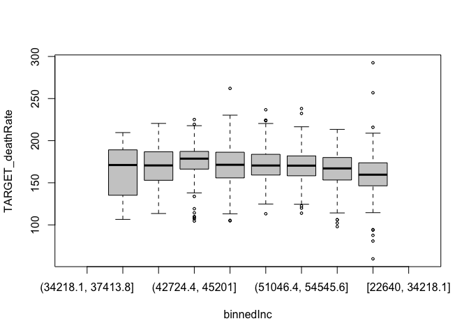
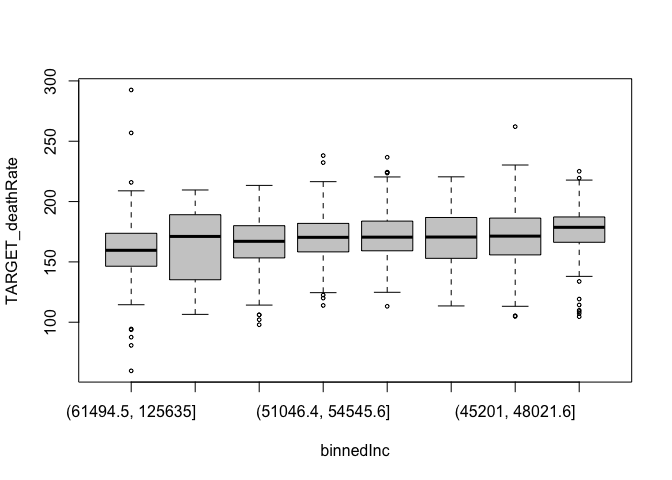
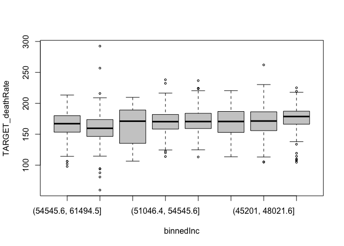
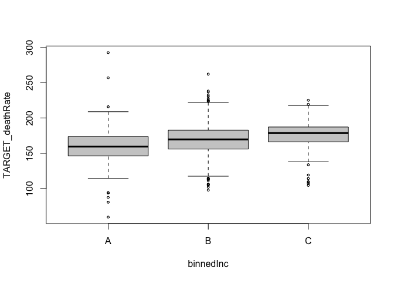
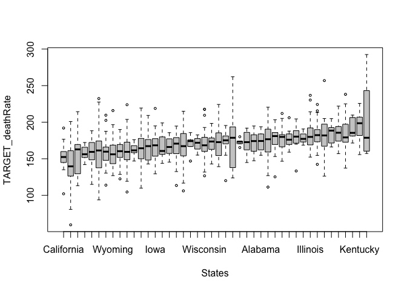
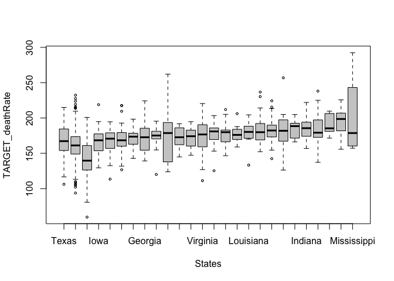
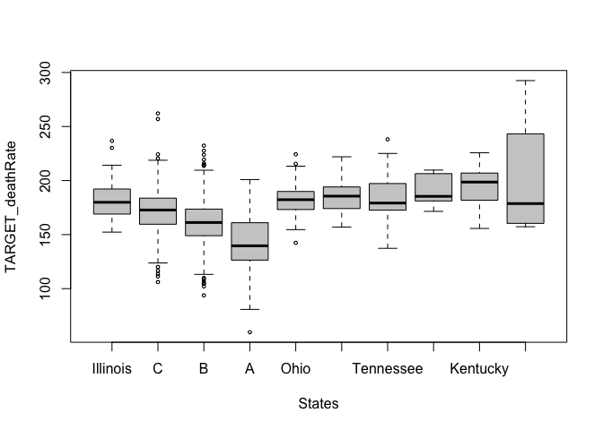
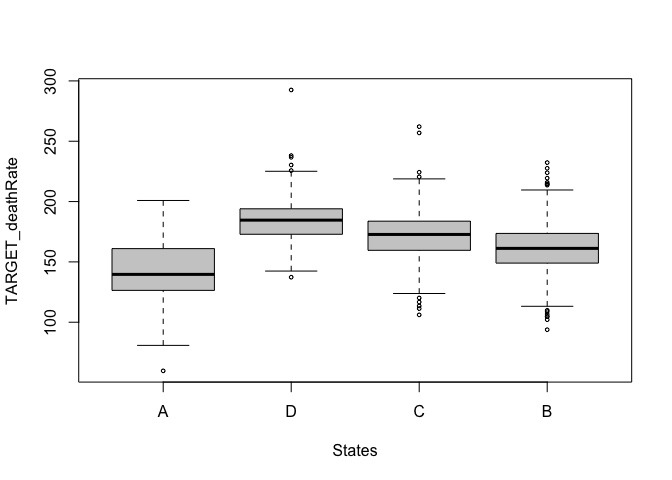

# INTRODUCTION
Nous avons à notre disposition un ensemble de données sur des comptés aux États-Unis et nous voulons certes mettre en œuvre, sur des vraies données, les techniques exposées en cours. En effet, les observations tirées de cette base de données peuvent être représentées graphiquement par un nuage de point. Ainsi, nous s’intéresserons à tracer la droite qui s’ajuste le mieux possible à ce nuage de points. Autrement dit, nous recherchons une relation affine entre la variable à expliquer et les variables explicatives. De ce fait, l’objectif principale du premier devoir de STT5100 est axé sur la construction d’un modèle linéaire par la méthode des moindres carrés ordinaires (MCO). La méthode MCO est une approche naturelle qui consiste, en autres, à estimer les paramètres β qui permet de minimiser la somme des carrés des résidus (SCR), c’est-à-dire, de rendre minimale la somme des carrés des écarts des valeurs observées $y_{i}$ à la prévision $\hat{y_{i}} = x^{⊤}_{i}\hat{β}$. Dans le cadre du projet, nous présenterons, en premier lieu, les variables qui pourraient potentiellement être intéressantes pour la construction du modèle. En deuxième lieu, nous expliquerons comment nous sommes parvenus, d’une part, à l’amélioration d’un modèle simple. D’autre part, nous allons également expliquer la méthode exploitée permettant de construire parallèlement un second modèle plus complexe et d’illustrer les moyens de le simplifier. En dernier lieu, nous présenterons sommairement la forme finale des deux modèles construites à l’étape précédente en comparant leur coefficient d’ajustement ajusté $R^{2}_{adj}$ , leur indice d’Akaike AIC et leur indice de BIC.

# PARTIE I

Dans cette partie exploratoire, nous présenterons les variables qui pourraient potentiellement être intéressantes pour la construction du modèle. Dans un premier temps, nous allons d’abord nous focaliser sur la base de données fournies. La base de données contient 1274 observations sur des comptés aux États-Unis et 32 variables. Précisement, TARGET_deathRate est la variable d’intérêt représentant la moyenne par habitant (100 000) décès par cancer. 


```r
code_permanent = "GIAD14029707"
loc_fichier = paste("http://freakonometrics.free.fr/",code_permanent,"H2020D1.RData",sep="")
download.file(loc_fichier, "base_devoir_1.RData")
load("base_devoir_1.RData")
DF<-database
str(DF)
```

```
## 'data.frame':	1274 obs. of  32 variables:
##  $ avgAnnCount           : num  1397 102 57 4025 113 ...
##  $ avgDeathsPerYear      : int  469 50 26 1380 36 26 1118 483 12 215 ...
##  $ TARGET_deathRate      : num  165 175 144 178 121 ...
##  $ incidenceRate         : num  490 350 350 511 413 ...
##  $ medIncome             : int  61898 49348 49955 60397 54721 52673 71890 61653 51022 56737 ...
##  $ popEst2015            : int  260131 21026 10321 843954 16252 11339 772501 269536 4042 111901 ...
##  $ povertyPercent        : num  11.2 14.6 12.5 13.1 12.7 12.6 9.9 11.9 13.9 13.2 ...
##  $ studyPerCap           : num  499.7 47.6 0 427.7 0 ...
##  $ binnedInc             : Factor w/ 10 levels "(34218.1, 37413.8]",..: 9 6 6 8 8 7 9 9 6 8 ...
##  $ MedianAge             : num  39.3 45 48.3 35.8 54.4 45.2 37.6 38.5 52.1 38.4 ...
##  $ MedianAgeMale         : num  36.9 44 47.8 34.7 54 44.9 36.6 37.1 51.5 38 ...
##  $ MedianAgeFemale       : num  41.7 45.8 48.9 37 54.6 45.5 38.7 39.9 53.1 38.6 ...
##  $ Geography             : Factor w/ 3047 levels "Abbeville County, South Carolina",..: 1459 1464 1618 2185 2427 2537 2543 2703 2819 187 ...
##  $ AvgHouseholdSize      : num  2.54 2.62 2.34 2.65 2.04 2.49 2.68 2.52 2.31 0.0263 ...
##  $ PercentMarried        : num  52.5 54.2 57.8 50 56.8 54.4 52.1 52.4 53.5 51.8 ...
##  $ PctNoHS18_24          : num  11.5 24 14.9 15.6 17.7 20 15.4 14.8 37.2 17 ...
##  $ PctHS18_24            : num  39.5 36.6 43 36.3 32.4 43.8 33.3 31.7 20.8 40.8 ...
##  $ PctBachDeg18_24       : num  6.9 9.5 2 7.1 5.2 2.4 8.3 7.4 4.2 10 ...
##  $ PctHS25_Over          : num  23.2 29 33.4 28.8 17.2 29.2 24.3 22.7 33.1 38.2 ...
##  $ PctBachDeg25_Over     : num  19.6 16 15 16.2 26.2 14.2 20.9 20.3 10.1 12.7 ...
##  $ PctEmployed16_Over    : num  51.9 45.9 48.2 56.6 54.6 51.5 62.1 56.5 35.7 58.7 ...
##  $ PctUnemployed16_Over  : num  8 7 4.8 9.2 5.9 8.3 7.5 8.5 10.6 9.7 ...
##  $ PctPrivateCoverage    : num  75.1 63.7 61.6 69.9 67.2 64.4 73.3 74.5 64.7 70 ...
##  $ PctEmpPrivCoverage    : num  41.6 34.9 35.1 44.4 27.9 42.6 54.3 43.5 35.2 49.7 ...
##  $ PctPublicCoverage     : num  32.9 42.1 44 31.4 41.6 36.1 25.9 30.7 49.7 33.1 ...
##  $ PctPublicCoverageAlone: num  14 21.1 22.7 16.5 18.3 20.5 14.1 13.7 20.4 17.3 ...
##  $ PctWhite              : num  81.8 90.9 94.1 74.7 92.6 ...
##  $ PctBlack              : num  2.595 0.74 0.27 6.711 0.652 ...
##  $ PctAsian              : num  4.822 0.466 0.666 6.041 1.429 ...
##  $ PctOtherRace          : num  1.843 2.747 0.492 2.699 2.237 ...
##  $ PctMarriedHouseholds  : num  52.9 54.4 54 50.1 50 ...
##  $ BirthRate             : num  6.12 3.73 6.8 5.53 4.59 ...
```

## (1.1) COMBINER LES MODALITÉS DES VARIABLE FACTORIELLE

Parmi les 31 autres variables explicatives, nous avons deux variables factorielles, dont binnedInc et Geography. En effet, ces deux variables de type factorielle comportent individuellement plusieurs modalités et nous pose certes un véritable problème parce que chaque modalité nous ajoute une variable explicative de plus à considérer pour la modélisation. Par exemple, la variable Geography contient 3047 modalités et par conséquent, nous devons considérer 3047 variables explicatives de plus. Pour y remédier, nous allons les regrouper efficacement les modalités afin de simplifier la procédure de sélection de variables explicatives à l’aide des boîtes à moustaches et du test de Fisher. 

### (1.1.1) VARIABLE binnedInc

D’abords, la variable binnedInc est constituée de 10 modalités. Toutefois, la boîte à moustaches n’a retenu que 8 modalités étant significatives.


```r
with(data = DF, boxplot(TARGET_deathRate~binnedInc,cex=.5,col=grey(.8)))
```

<!-- -->

Afin d’obtenir la visualisation la plus nette possible à notre boîte à moustaches, nous avons commencé par réordonner les modalités en prenant comme référence le revenu médian par habitant par décile ayant la moyenne par habitant (100 000) décès par cancer, le plus faible. Précisément, le décile (61494.5, 125635] est notre modalité de référence.


```r
A = with(data = DF, aggregate(TARGET_deathRate,by=list(binnedInc),FUN=mean))
A = A[order(A$x),]
L = as.character(A$Group.1)
DF$binnedInc= factor(DF$binnedInc, level=L)
with(data = DF, boxplot(TARGET_deathRate~binnedInc,cex=.5,col=grey(.8)))
```

<!-- -->

```r
reg_binnedInc = lm(TARGET_deathRate~binnedInc, data = DF)
summary(reg_binnedInc)
```

```
## 
## Call:
## lm(formula = TARGET_deathRate ~ binnedInc, data = DF)
## 
## Residuals:
##      Min       1Q   Median       3Q      Max 
## -100.084  -12.487    0.709   13.644  132.716 
## 
## Coefficients:
##                             Estimate Std. Error t value Pr(>|t|)    
## (Intercept)                  159.784      1.481 107.902  < 2e-16 ***
## binnedInc(37413.8, 40362.7]    3.980      6.245   0.637  0.52404    
## binnedInc(54545.6, 61494.5]    6.261      2.022   3.097  0.00200 ** 
## binnedInc(51046.4, 54545.6]    9.937      2.075   4.790 1.87e-06 ***
## binnedInc(48021.6, 51046.4]   11.004      2.120   5.191 2.43e-07 ***
## binnedInc(40362.7, 42724.4]   11.204      4.113   2.724  0.00654 ** 
## binnedInc(45201, 48021.6]     11.808      2.372   4.977 7.34e-07 ***
## binnedInc(42724.4, 45201]     15.952      2.710   5.885 5.08e-09 ***
## ---
## Signif. codes:  0 '***' 0.001 '**' 0.01 '*' 0.05 '.' 0.1 ' ' 1
## 
## Residual standard error: 22.7 on 1266 degrees of freedom
## Multiple R-squared:  0.04094,	Adjusted R-squared:  0.03563 
## F-statistic:  7.72 on 7 and 1266 DF,  p-value: 3.674e-09
```

Au premier abord, aucune modalité nous semble adéquate pour regrouper avec le décile (61494.5, 125635]. De ce fait, nous allons recommencer la procédure en mettant, cette fois-ci, (54545.6, 61494.5] comme modalité de référence.


```r
DF$binnedInc = relevel(DF$binnedInc,"(54545.6, 61494.5]")
with(data = DF, boxplot(TARGET_deathRate~binnedInc,cex=.5,col=grey(.8)))
```

<!-- -->

```r
reg_binnedInc = lm(TARGET_deathRate~binnedInc, data = DF)
summary(reg_binnedInc)
```

```
## 
## Call:
## lm(formula = TARGET_deathRate ~ binnedInc, data = DF)
## 
## Residuals:
##      Min       1Q   Median       3Q      Max 
## -100.084  -12.487    0.709   13.644  132.716 
## 
## Coefficients:
##                             Estimate Std. Error t value Pr(>|t|)    
## (Intercept)                  166.046      1.376 120.635  < 2e-16 ***
## binnedInc(61494.5, 125635]    -6.261      2.022  -3.097 0.001998 ** 
## binnedInc(37413.8, 40362.7]   -2.281      6.221  -0.367 0.713904    
## binnedInc(51046.4, 54545.6]    3.676      2.002   1.837 0.066507 .  
## binnedInc(48021.6, 51046.4]    4.742      2.048   2.315 0.020751 *  
## binnedInc(40362.7, 42724.4]    4.943      4.077   1.213 0.225526    
## binnedInc(45201, 48021.6]      5.546      2.309   2.402 0.016430 *  
## binnedInc(42724.4, 45201]      9.690      2.655   3.650 0.000273 ***
## ---
## Signif. codes:  0 '***' 0.001 '**' 0.01 '*' 0.05 '.' 0.1 ' ' 1
## 
## Residual standard error: 22.7 on 1266 degrees of freedom
## Multiple R-squared:  0.04094,	Adjusted R-squared:  0.03563 
## F-statistic:  7.72 on 7 and 1266 DF,  p-value: 3.674e-09
```

Nous allons effectuer un test multiple afin de tester si les 5 déciles suivants ont effectivement des coefficients nuls dans la régression linéaire : (37413.8, 40362.7], (40362.7, 42724.4], (51046.4, 54545.6], (48021.6, 51046.4] et (45201, 48021.6]. De ce fait, nous allons procéder avec un test de Fisher.


```r
library(car)
```

```
## Loading required package: carData
```

```r
linearHypothesis(reg_binnedInc, c("binnedInc(37413.8, 40362.7] = 0", 
                        "binnedInc(40362.7, 42724.4] = 0",
                        "binnedInc(45201, 48021.6]  = 0",
                        "binnedInc(48021.6, 51046.4]= 0",
                        "binnedInc(51046.4, 54545.6] = 0"))
```

```
## Linear hypothesis test
## 
## Hypothesis:
## binnedInc(37413.8, 40362.7] = 0
## binnedInc(40362.7, 42724.4] = 0
## binnedInc(45201, 48021.6] = 0
## binnedInc(48021.6, 51046.4] = 0
## binnedInc(51046.4, 54545.6] = 0
## 
## Model 1: restricted model
## Model 2: TARGET_deathRate ~ binnedInc
## 
##   Res.Df    RSS Df Sum of Sq      F Pr(>F)
## 1   1271 657112                           
## 2   1266 652391  5    4720.7 1.8321 0.1037
```

Le statistique de Fisher est faible avec une p-value de 0.1037. Cependant, avant de précipiter le regroupement de ces cinq modalités, il est nécessaire de vérifier s’il serait également adéquat de d’ajouter le décile (42724.4, 45201] au regroupement précédent.


```r
linearHypothesis(reg_binnedInc, c("binnedInc(37413.8, 40362.7] = 0", 
                                  "binnedInc(40362.7, 42724.4] = 0",
                                  "binnedInc(51046.4, 54545.6] = 0",
                                  "binnedInc(48021.6, 51046.4]= 0",
                                  "binnedInc(45201, 48021.6]  = 0",
                                  "binnedInc(42724.4, 45201] = 0"))
```

```
## Linear hypothesis test
## 
## Hypothesis:
## binnedInc(37413.8, 40362.7] = 0
## binnedInc(40362.7, 42724.4] = 0
## binnedInc(51046.4, 54545.6] = 0
## binnedInc(48021.6, 51046.4] = 0
## binnedInc(45201, 48021.6] = 0
## binnedInc(42724.4, 45201] = 0
## 
## Model 1: restricted model
## Model 2: TARGET_deathRate ~ binnedInc
## 
##   Res.Df    RSS Df Sum of Sq      F  Pr(>F)  
## 1   1272 661010                              
## 2   1266 652391  6    8618.9 2.7876 0.01069 *
## ---
## Signif. codes:  0 '***' 0.001 '**' 0.01 '*' 0.05 '.' 0.1 ' ' 1
```

Or, Le statistique de Fisher avec l’ajout du décile (42724.4, 45201] est relativement élevé avec une p-value de 0.01069. Ainsi, nous décidons de ne pas inclure le décile (42724.4, 45201] au regroupement des cinq modalités précédentes.


```r
levels(DF$binnedInc) = c("B","A",rep("B",5),"C")
DF$binnedInc = relevel(DF$binnedInc,"A")
with(data = DF, boxplot(TARGET_deathRate~binnedInc,cex=.5,col=grey(.8)))
```

<!-- -->

```r
reg_binnedInc = lm(TARGET_deathRate~binnedInc, data = DF)
summary(reg_binnedInc)
```

```
## 
## Call:
## lm(formula = TARGET_deathRate ~ binnedInc, data = DF)
## 
## Residuals:
##      Min       1Q   Median       3Q      Max 
## -100.084  -12.855    0.524   13.582  132.716 
## 
## Coefficients:
##             Estimate Std. Error t value Pr(>|t|)    
## (Intercept)  159.784      1.483 107.726  < 2e-16 ***
## binnedIncB     9.384      1.658   5.658 1.89e-08 ***
## binnedIncC    15.952      2.715   5.876 5.37e-09 ***
## ---
## Signif. codes:  0 '***' 0.001 '**' 0.01 '*' 0.05 '.' 0.1 ' ' 1
## 
## Residual standard error: 22.74 on 1271 degrees of freedom
## Multiple R-squared:  0.034,	Adjusted R-squared:  0.03248 
## F-statistic: 22.37 on 2 and 1271 DF,  p-value: 2.844e-10
```

Enfin, nous avons réussi à réduire le nombre de modalités pour la variable binnedInc et nous nous retrouvons avec les trois sous-groupes suivants : A, B et C.

Où

binnedIncA = (61494.5, 125635]

binnedIncB = (37413.8, 42724.4] et (45201, 461494.5]

binnedIncC =  (42724.4, 45201]

### (1.1.2) VARIABLE Geography

Ensuite, la variable Geography est constituée de 3047 modalités en totale et par induction, nécessite un regroupement davantage complexe. Afin d’aboutir au regroupement des modalités, nous avons décidé de créer une nouvelle variable explicative dans la base de données réunissant tous les comptés américains par leur état respectif. Par conséquent, ce rassemblement nous permet de réduire de manière importante le nombre de modalités à 50. Par la suite, nous allons procéder au regroupement des états similairement à la méthode utilisée pour combiner les modalités de la variable binnedInc, c’est-à-dire à l’aide des boîtes à moustaches et du test de Fisher.

Afin d’obtenir la visualisation la plus nette possible à notre boîte à moustaches, nous avons commencé par réordonner les modalités en prenant comme référence l’état américain ayant la moyenne par habitant (100 000) décès par cancer, le plus faible. Précisément, l’état de Colorado est notre modalité de référence.


```r
DF$States=sub(".*, *(.*?) * *", "\\1", DF$Geography)
A = with(data = DF, aggregate(TARGET_deathRate,by=list(States),FUN=mean))
A = A[order(A$x),]
L = as.character(A$Group.1)
DF$States= factor(DF$States, level=L)
with(data = DF, boxplot(TARGET_deathRate~States,cex=.5,col=grey(.8)))
```

<!-- -->

```r
reg_States = lm(TARGET_deathRate~States, data = DF)
summary(reg_States)
```

```
## 
## Call:
## lm(formula = TARGET_deathRate ~ States, data = DF)
## 
## Residuals:
##     Min      1Q  Median      3Q     Max 
## -75.848 -12.079   0.227  11.208  90.700 
## 
## Coefficients:
##                      Estimate Std. Error t value Pr(>|t|)    
## (Intercept)           135.548      3.661  37.020  < 2e-16 ***
## StatesUtah              1.310      5.940   0.220 0.825545    
## StatesHawaii            5.885     12.326   0.477 0.633145    
## StatesIdaho            10.635      6.041   1.760 0.078587 .  
## StatesCalifornia       16.732      5.421   3.086 0.002072 ** 
## StatesNew Mexico       17.702     14.873   1.190 0.234207    
## StatesMontana          20.392      5.847   3.488 0.000505 ***
## StatesConnecticut      22.164      8.084   2.742 0.006203 ** 
## StatesWashington       22.164      6.275   3.532 0.000428 ***
## StatesNorth Dakota     22.936      4.780   4.798 1.80e-06 ***
## StatesSouth Dakota     23.681      4.964   4.771 2.06e-06 ***
## StatesWyoming          23.866      5.762   4.142 3.68e-05 ***
## StatesMinnesota        24.273      4.439   5.468 5.51e-08 ***
## StatesNebraska         24.706      4.398   5.617 2.40e-08 ***
## StatesArizona          25.652     20.713   1.238 0.215784    
## StatesMassachusetts    26.970      7.155   3.770 0.000171 ***
## StatesRhode Island     27.577     10.831   2.546 0.011015 *  
## StatesKansas           28.061      4.328   6.483 1.30e-10 ***
## StatesFlorida          29.878      5.940   5.030 5.63e-07 ***
## StatesIowa             30.213      4.345   6.954 5.75e-12 ***
## StatesNorth Carolina   30.596      6.041   5.065 4.72e-07 ***
## StatesOregon           31.014      8.084   3.836 0.000131 ***
## StatesMichigan         32.238      5.267   6.121 1.25e-09 ***
## StatesTexas            32.641      4.362   7.484 1.37e-13 ***
## StatesSouth Carolina   35.052      9.093   3.855 0.000122 ***
## StatesNew Hampshire    35.185      7.719   4.558 5.68e-06 ***
## StatesWisconsin        35.191      4.643   7.580 6.82e-14 ***
## StatesNew York         36.164      5.099   7.092 2.23e-12 ***
## StatesGeorgia          36.331      5.543   6.555 8.21e-11 ***
## StatesMaryland         36.912      6.412   5.757 1.08e-08 ***
## StatesNevada           37.143      7.155   5.191 2.44e-07 ***
## StatesMaine            37.235      9.093   4.095 4.50e-05 ***
## StatesPennsylvania     37.636      4.737   7.945 4.38e-15 ***
## StatesNew Jersey       37.767      6.736   5.607 2.55e-08 ***
## StatesAlabama          38.052      8.531   4.460 8.93e-06 ***
## StatesVirginia         39.301      4.450   8.832  < 2e-16 ***
## StatesOklahoma         41.281      5.366   7.692 2.96e-14 ***
## StatesMissouri         41.337      5.366   7.703 2.74e-14 ***
## StatesVermont          41.633      7.155   5.819 7.55e-09 ***
## StatesLouisiana        41.677      8.084   5.155 2.95e-07 ***
## StatesDelaware         43.318     12.326   3.514 0.000457 ***
## StatesIllinois         46.429      4.473  10.381  < 2e-16 ***
## StatesOhio             47.179      4.878   9.671  < 2e-16 ***
## StatesAlaska           47.252      7.155   6.604 5.94e-11 ***
## StatesArkansas         48.423      8.531   5.676 1.72e-08 ***
## StatesIndiana          49.844      4.594  10.850  < 2e-16 ***
## StatesTennessee        50.524      7.155   7.062 2.75e-12 ***
## StatesWest Virginia    55.339      8.084   6.845 1.20e-11 ***
## StatesKentucky         59.525      6.412   9.283  < 2e-16 ***
## StatesMississippi      66.252     10.831   6.117 1.28e-09 ***
## ---
## Signif. codes:  0 '***' 0.001 '**' 0.01 '*' 0.05 '.' 0.1 ' ' 1
## 
## Residual standard error: 20.39 on 1224 degrees of freedom
## Multiple R-squared:  0.2522,	Adjusted R-squared:  0.2222 
## F-statistic: 8.423 on 49 and 1224 DF,  p-value: < 2.2e-16
```

Nous allons effectuer un test multiple afin de tester si les six états américains suivants ont effectivement des coefficients nuls dans la régression linéaire : Utah, Hawaii, Idaho, New Mexico, Arizona et Rhode Island. De ce fait, nous allons procéder avec un test de Fisher.


```r
linearHypothesis(reg_States, c("StatesUtah = 0", 
                               "StatesHawaii  = 0",
                               "StatesIdaho  = 0",
                               "StatesNew Mexico = 0",
                               "StatesArizona  = 0",
                               "StatesRhode Island = 0"))
```

```
## Linear hypothesis test
## 
## Hypothesis:
## StatesUtah = 0
## StatesHawaii = 0
## StatesIdaho = 0
## StatesNew Mexico = 0
## StatesArizona = 0
## StatesRhode Island = 0
## 
## Model 1: restricted model
## Model 2: TARGET_deathRate ~ States
## 
##   Res.Df    RSS Df Sum of Sq      F Pr(>F)
## 1   1230 513091                           
## 2   1224 508698  6    4392.6 1.7615 0.1036
```
Le statistique de Fisher est faible avec une p-value de 0.1036. Nous allons donc regrouper ces six modalités. Récursivement, nous allons recommencer la procédure en mettant, cette fois-ci, l'état de Californie comme modalité de référence.


```r
levels(DF$States) = c(rep("A",4),levels(DF$States)[5],"A",levels(DF$States)[7:14],"A",levels(DF$States)[16],"A",levels(DF$States)[18:50])
DF$States = relevel(DF$States,"California")
with(data = DF, boxplot(TARGET_deathRate~States,cex=.5,col=grey(.8)))
```

<!-- -->

```r
reg_States = lm(TARGET_deathRate~States, data = DF)
summary(reg_States)
```

```
## 
## Call:
## lm(formula = TARGET_deathRate ~ States, data = DF)
## 
## Residuals:
##     Min      1Q  Median      3Q     Max 
## -81.045 -12.126   0.184  11.269  90.700 
## 
## Coefficients:
##                      Estimate Std. Error t value Pr(>|t|)    
## (Intercept)           152.281      4.006  38.018  < 2e-16 ***
## StatesA               -11.536      4.625  -2.494 0.012756 *  
## StatesMontana           3.659      6.075   0.602 0.547035    
## StatesConnecticut       5.432      8.258   0.658 0.510797    
## StatesWashington        5.432      6.490   0.837 0.402766    
## StatesNorth Dakota      6.203      5.052   1.228 0.219740    
## StatesSouth Dakota      6.949      5.227   1.330 0.183925    
## StatesWyoming           7.134      5.992   1.190 0.234104    
## StatesMinnesota         7.540      4.729   1.594 0.111087    
## StatesNebraska          7.974      4.691   1.700 0.089416 .  
## StatesMassachusetts    10.237      7.346   1.394 0.163700    
## StatesKansas           11.328      4.625   2.449 0.014454 *  
## StatesFlorida          13.146      6.164   2.133 0.033162 *  
## StatesIowa             13.481      4.640   2.905 0.003736 ** 
## StatesNorth Carolina   13.864      6.263   2.214 0.027028 *  
## StatesOregon           14.282      8.258   1.730 0.083965 .  
## StatesMichigan         15.505      5.516   2.811 0.005019 ** 
## StatesTexas            15.908      4.656   3.417 0.000655 ***
## StatesSouth Carolina   18.319      9.250   1.980 0.047883 *  
## StatesNew Hampshire    18.453      7.899   2.336 0.019647 *  
## StatesWisconsin        18.458      4.922   3.750 0.000185 ***
## StatesNew York         19.431      5.356   3.628 0.000297 ***
## StatesGeorgia          19.598      5.781   3.390 0.000721 ***
## StatesMaryland         20.179      6.622   3.047 0.002359 ** 
## StatesNevada           20.410      7.346   2.778 0.005547 ** 
## StatesMaine            20.503      9.250   2.216 0.026846 *  
## StatesPennsylvania     20.904      5.011   4.171 3.24e-05 ***
## StatesNew Jersey       21.035      6.938   3.032 0.002481 ** 
## StatesAlabama          21.319      8.697   2.451 0.014370 *  
## StatesVirginia         22.568      4.739   4.762 2.15e-06 ***
## StatesOklahoma         24.549      5.612   4.374 1.32e-05 ***
## StatesMissouri         24.604      5.612   4.384 1.26e-05 ***
## StatesVermont          24.901      7.346   3.390 0.000722 ***
## StatesLouisiana        24.944      8.258   3.021 0.002573 ** 
## StatesDelaware         26.586     12.454   2.135 0.032975 *  
## StatesIllinois         29.697      4.761   6.238 6.09e-10 ***
## StatesOhio             30.447      5.145   5.918 4.23e-09 ***
## StatesAlaska           30.519      7.346   4.154 3.49e-05 ***
## StatesArkansas         31.691      8.697   3.644 0.000280 ***
## StatesIndiana          33.112      4.875   6.792 1.72e-11 ***
## StatesTennessee        33.792      7.346   4.600 4.66e-06 ***
## StatesWest Virginia    38.607      8.258   4.675 3.26e-06 ***
## StatesKentucky         42.793      6.622   6.462 1.49e-10 ***
## StatesMississippi      49.519     10.970   4.514 6.96e-06 ***
## ---
## Signif. codes:  0 '***' 0.001 '**' 0.01 '*' 0.05 '.' 0.1 ' ' 1
## 
## Residual standard error: 20.42 on 1230 degrees of freedom
## Multiple R-squared:  0.2457,	Adjusted R-squared:  0.2193 
## F-statistic: 9.318 on 43 and 1230 DF,  p-value: < 2.2e-16
```

Nous allons effectuer un test multiple afin de tester si les dix-huit états américains suivants ont des coefficients nuls dans la régression linéaire : Montana, Connecticut, Washington, North Dakota, South Dakota, Wyoming, Minnesota, Nebraska, Massachusetts, Kansas, Florida, North Carolina, Oregon, South Carolina, New Hampshire, Maine, Alabama et Delaware.


```r
linearHypothesis(reg_States, c("StatesMontana = 0", 
                               "StatesConnecticut = 0",
                               "StatesWashington = 0",
                               "StatesNorth Dakota = 0",
                               "StatesSouth Dakota  = 0",
                               "StatesWyoming = 0",
                               "StatesMinnesota = 0",
                               "StatesNebraska  = 0",
                               "StatesMassachusetts = 0",
                               "StatesKansas =0",
                               "StatesFlorida =0",
                               "StatesNorth Carolina =0",
                               "StatesOregon = 0",
                               "StatesSouth Carolina =0",
                               "StatesNew Hampshire =0",
                               "StatesMaine =0",
                               "StatesAlabama =0",
                               "StatesDelaware =0"))
```

```
## Linear hypothesis test
## 
## Hypothesis:
## StatesMontana = 0
## StatesConnecticut = 0
## StatesWashington = 0
## StatesNorth Dakota = 0
## StatesSouth Dakota = 0
## StatesWyoming = 0
## StatesMinnesota = 0
## StatesNebraska = 0
## StatesMassachusetts = 0
## StatesKansas = 0
## StatesFlorida = 0
## StatesNorth Carolina = 0
## StatesOregon = 0
## StatesSouth Carolina = 0
## StatesNew Hampshire = 0
## StatesMaine = 0
## StatesAlabama = 0
## StatesDelaware = 0
## 
## Model 1: restricted model
## Model 2: TARGET_deathRate ~ States
## 
##   Res.Df    RSS Df Sum of Sq      F Pr(>F)
## 1   1248 522371                           
## 2   1230 513091 18    9280.2 1.2359 0.2236
```

Le statistique de Fisher est faible avec une p-value de 0.2236. Nous allons donc regrouper ces dix-huit modalités. Encore une fois, nous allons recommencer la procédure en mettant, cette fois-ci, l'état de Texas comme modalité de référence.


```r
levels(DF$States) = c("B",levels(DF$States)[2],rep("B",11),
                      levels(DF$States)[14],rep("B",2),
                      levels(DF$States)[17:18],rep("B",2),
                      levels(DF$States)[21:25],"B",
                      levels(DF$States)[27:28],"B",
                      levels(DF$States)[30:34],"B",
                      levels(DF$States)[36:44])
DF$States = relevel(DF$States,"Texas")
with(data = DF, boxplot(TARGET_deathRate~States,cex=.5,col=grey(.8)))
```

<!-- -->

```r
reg_States = lm(TARGET_deathRate~States, data = DF)
summary(reg_States)
```

```
## 
## Call:
## lm(formula = TARGET_deathRate ~ States, data = DF)
## 
## Residuals:
##     Min      1Q  Median      3Q     Max 
## -81.045 -12.007   0.122  11.810  90.700 
## 
## Coefficients:
##                     Estimate Std. Error t value Pr(>|t|)    
## (Intercept)          168.189      2.378  70.718  < 2e-16 ***
## StatesB               -7.078      2.558  -2.767 0.005736 ** 
## StatesA              -27.444      3.320  -8.266 3.50e-16 ***
## StatesIowa            -2.427      3.341  -0.726 0.467678    
## StatesMichigan        -0.403      4.482  -0.090 0.928374    
## StatesWisconsin        2.550      3.723   0.685 0.493553    
## StatesNew York         3.523      4.282   0.823 0.410877    
## StatesGeorgia          3.690      4.806   0.768 0.442749    
## StatesMaryland         4.271      5.793   0.737 0.461130    
## StatesNevada           4.502      6.611   0.681 0.496046    
## StatesPennsylvania     4.996      3.841   1.300 0.193671    
## StatesNew Jersey       5.126      6.152   0.833 0.404900    
## StatesVirginia         6.660      3.478   1.915 0.055726 .  
## StatesOklahoma         8.640      4.600   1.878 0.060558 .  
## StatesMissouri         8.696      4.600   1.890 0.058924 .  
## StatesVermont          8.993      6.611   1.360 0.174008    
## StatesLouisiana        9.036      7.614   1.187 0.235574    
## StatesIllinois        13.789      3.507   3.932 8.90e-05 ***
## StatesOhio            14.538      4.015   3.621 0.000305 ***
## StatesAlaska          14.611      6.611   2.210 0.027285 *  
## StatesArkansas        15.782      8.090   1.951 0.051306 .  
## StatesIndiana         17.203      3.662   4.698 2.91e-06 ***
## StatesTennessee       17.884      6.611   2.705 0.006923 ** 
## StatesWest Virginia   22.698      7.614   2.981 0.002929 ** 
## StatesKentucky        26.884      5.793   4.641 3.84e-06 ***
## StatesMississippi     33.611     10.502   3.200 0.001407 ** 
## ---
## Signif. codes:  0 '***' 0.001 '**' 0.01 '*' 0.05 '.' 0.1 ' ' 1
## 
## Residual standard error: 20.46 on 1248 degrees of freedom
## Multiple R-squared:  0.2321,	Adjusted R-squared:  0.2167 
## F-statistic: 15.09 on 25 and 1248 DF,  p-value: < 2.2e-16
```

Nous allons effectuer un test multiple afin de tester si les seize états américains suivant ont des coefficients nuls dans la régression linéaire : Iowa, Michigan, Wisconsin, New York, Georgia, Maryland, Nevada, Pennsylvania, New Jersey, Virginia, Oklahoma, Missouri, Vermont, Louisiana, Alaska et Arkansas.


```r
linearHypothesis(reg_States, c("StatesIowa  = 0", 
                               "StatesMichigan  = 0",
                               "StatesWisconsin = 0",
                               "StatesNew York = 0",
                               "StatesGeorgia  = 0",
                               "StatesMaryland = 0",
                               "StatesNevada = 0",
                               "StatesPennsylvania  = 0",
                               "StatesNew Jersey = 0",
                               "StatesVirginia =0",
                               "StatesOklahoma =0",
                               "StatesMissouri =0",
                               "StatesVermont = 0",
                               "StatesLouisiana =0",
                               "StatesAlaska  =0",
                               "StatesArkansas =0"))
```

```
## Linear hypothesis test
## 
## Hypothesis:
## StatesIowa = 0
## StatesMichigan = 0
## StatesWisconsin = 0
## StatesNew York = 0
## StatesGeorgia = 0
## StatesMaryland = 0
## StatesNevada = 0
## StatesPennsylvania = 0
## StatesNew Jersey = 0
## StatesVirginia = 0
## StatesOklahoma = 0
## StatesMissouri = 0
## StatesVermont = 0
## StatesLouisiana = 0
## StatesAlaska = 0
## StatesArkansas = 0
## 
## Model 1: restricted model
## Model 2: TARGET_deathRate ~ States
## 
##   Res.Df    RSS Df Sum of Sq      F Pr(>F)
## 1   1264 531672                           
## 2   1248 522371 16    9301.3 1.3889 0.1384
```

Le statistique de Fisher est faible avec une p-value de 0.1384. Nous allons donc regrouper ces seize modalités. Par la suite, nous allons recommencer la procédure en mettant, cette fois-ci, l'état de Illinois comme modalité de référence.


```r
levels(DF$States) = c("C",levels(DF$States)[2:3],rep("C",14),
                      levels(DF$States)[18:19],rep("C",2),
                      levels(DF$States)[22:26])
DF$States = relevel(DF$States,"Illinois")
with(data = DF, boxplot(TARGET_deathRate~States,cex=.5,col=grey(.8)))
```

<!-- -->

```r
reg_States = lm(TARGET_deathRate~States, data = DF)
summary(reg_States)
```

```
## 
## Call:
## lm(formula = TARGET_deathRate ~ States, data = DF)
## 
## Residuals:
##     Min      1Q  Median      3Q     Max 
## -81.045 -12.157   0.141  11.918  90.700 
## 
## Coefficients:
##                     Estimate Std. Error t value Pr(>|t|)    
## (Intercept)         181.9778     2.5839  70.427  < 2e-16 ***
## StatesC             -10.2051     2.7337  -3.733 0.000198 ***
## StatesB             -20.8661     2.7506  -7.586 6.37e-14 ***
## StatesA             -41.2329     3.4741 -11.869  < 2e-16 ***
## StatesOhio            0.7497     4.1464   0.181 0.856542    
## StatesIndiana         3.4148     3.8034   0.898 0.369448    
## StatesTennessee       4.0949     6.7019   0.611 0.541300    
## StatesWest Virginia   8.9097     7.6977   1.157 0.247308    
## StatesKentucky       13.0956     5.8922   2.223 0.026425 *  
## StatesMississippi    19.8222    10.5751   1.874 0.061103 .  
## ---
## Signif. codes:  0 '***' 0.001 '**' 0.01 '*' 0.05 '.' 0.1 ' ' 1
## 
## Residual standard error: 20.51 on 1264 degrees of freedom
## Multiple R-squared:  0.2184,	Adjusted R-squared:  0.2128 
## F-statistic: 39.24 on 9 and 1264 DF,  p-value: < 2.2e-16
```

Nous allons effectuer un test multiple afin de tester si les six états américains restant ont des coefficients nuls dans la régression linéaire : Ohio, Indiana, Tennessee, West Virginia, Kentucky et Mississippi.


```r
linearHypothesis(reg_States, c("StatesOhio = 0", 
                               "StatesIndiana = 0",
                               "StatesTennessee = 0",
                               "StatesWest Virginia = 0",
                               "StatesKentucky = 0",
                               "StatesMississippi= 0"))
```

```
## Linear hypothesis test
## 
## Hypothesis:
## StatesOhio = 0
## StatesIndiana = 0
## StatesTennessee = 0
## StatesWest Virginia = 0
## StatesKentucky = 0
## StatesMississippi = 0
## 
## Model 1: restricted model
## Model 2: TARGET_deathRate ~ States
## 
##   Res.Df    RSS Df Sum of Sq      F Pr(>F)
## 1   1270 535402                           
## 2   1264 531672  6    3729.8 1.4779 0.1822
```

Le statistique de Fisher est faible avec une p-value de 0.1822. Ainsi, nous allons regrouper ces six modalités.


```r
levels(DF$States) = c("D",levels(DF$States)[2:4],rep("D",6))
DF$States = relevel(DF$States,"A")
with(data = DF, boxplot(TARGET_deathRate~States,cex=.5,col=grey(.8)))
```

<!-- -->

```r
reg_States = lm(TARGET_deathRate~States, data = DF)
summary(reg_States)
```

```
## 
## Call:
## lm(formula = TARGET_deathRate ~ States, data = DF)
## 
## Residuals:
##     Min      1Q  Median      3Q     Max 
## -81.045 -12.173   0.188  11.924 107.412 
## 
## Coefficients:
##             Estimate Std. Error t value Pr(>|t|)    
## (Intercept)  140.745      2.325  60.540  < 2e-16 ***
## StatesD       44.343      2.751  16.120  < 2e-16 ***
## StatesC       31.028      2.491  12.458  < 2e-16 ***
## StatesB       20.367      2.509   8.117 1.12e-15 ***
## ---
## Signif. codes:  0 '***' 0.001 '**' 0.01 '*' 0.05 '.' 0.1 ' ' 1
## 
## Residual standard error: 20.53 on 1270 degrees of freedom
## Multiple R-squared:  0.2129,	Adjusted R-squared:  0.2111 
## F-statistic: 114.5 on 3 and 1270 DF,  p-value: < 2.2e-16
```

En résumé, nous avons introduit dans la base de données une nouvelle variable nommée « States » qui rassemble tous les comptés américains par états et nous avons réussi à réduire significativement le nombre de modalités qu’elle possédait initialement. Nous nous retrouvons donc avec les quatre sous-groupes suivants : A, B, C et D.

Où

StatesA = Utah, Hawaii, Idaho, New Mexico, Arizona et Rhode Island

StatesB = Montana, Connecticut, Washington, North Dakota, South Dakota, Wyoming, Minnesota, Nebraska, Massachusetts, Kansas, Florida, North Carolina, Oregon, South Carolina, New Hampshire, Maine et Alabama, Delaware

StatesC = Iowa, Michigan, Wisconsin, New York, Georgia, Maryland, Nevada, Pennsylvania, New Jersey, Virginia, Oklahoma, Missouri, Vermont, Louisiana, Alaska et Arkansas

SatesD = Ohio, Indiana, Tennessee, West Virginia, Kentucky et Mississippi.


## (1.2) TEST DE CORRÉLATION

Dans un deuxième temps, afin de simplifier la sélection des variables explicatives, nous allons réduire le nombre de variables explicatives à considérer en se fiant à un test de corrélation. En effet, le test de corrélation permet d’évaluer la dépendance entre deux variables en calculant leur coefficient de corrélation. Certes, lorsque nous avons deux variables explicatives qui sont très corrélés, il est redondant de garder ces deux variables pour la construction du modèle en raison qu’elles ne nous apportent pas d’information supplémentaire dans la prévision. Nous avons donc l’option de supprimer la moins pertinente parmi les deux afin de faciliter la sélection des variable explicatives. 

Pour se faire, nous avons d’abords vérifié qu’il n’y a effectivement pas de données de type « N/A » dans la base de données. Il n’y a donc pas d’ajustements à faire par rapport aux données manquantes. Cependant, les variables factorielles peuvent causer problèmes dans le calcul du coefficient de corrélation, donc nous devons faire une petite conversion numérique temporaire avant de pouvoir procéder au calcul de la matrice de corrélation. De plus, nous ne devons pas oublier de retirer la variable Geography de la base de données, étant donné qu’elle sera remplacée par la nouvelle variable States.  


```r
sapply(DF,function(X) sum(is.na(X)))
```

```
##            avgAnnCount       avgDeathsPerYear       TARGET_deathRate 
##                      0                      0                      0 
##          incidenceRate              medIncome             popEst2015 
##                      0                      0                      0 
##         povertyPercent            studyPerCap              binnedInc 
##                      0                      0                      0 
##              MedianAge          MedianAgeMale        MedianAgeFemale 
##                      0                      0                      0 
##              Geography       AvgHouseholdSize         PercentMarried 
##                      0                      0                      0 
##           PctNoHS18_24             PctHS18_24        PctBachDeg18_24 
##                      0                      0                      0 
##           PctHS25_Over      PctBachDeg25_Over     PctEmployed16_Over 
##                      0                      0                      0 
##   PctUnemployed16_Over     PctPrivateCoverage     PctEmpPrivCoverage 
##                      0                      0                      0 
##      PctPublicCoverage PctPublicCoverageAlone               PctWhite 
##                      0                      0                      0 
##               PctBlack               PctAsian           PctOtherRace 
##                      0                      0                      0 
##   PctMarriedHouseholds              BirthRate                 States 
##                      0                      0                      0
```

```r
DF<-DF[,-13]
DF$binnedInc<-as.numeric(as.factor(DF$binnedInc))
DF$States<-as.numeric(as.factor(DF$States))
COR_MAT<-cor(DF[,-3],method = "pearson")
```

Remarques : Nous avons retiré la variable TARGET_deathRate du calcul de la matrice de corrélation puisqu’il ne fait pas parti des variables explicatives à comparer. Par ailleurs, le test de corrélation par la méthode de Pearson a été retenue et nous permet mesurer la dépendance linéaire entre nos variables.

Ensuite, le package plotly de R est uniquement utilisé dans ce devoir pour visualiser la matrice de corrélation. En effet, un corrélogramme est une représentation graphique de la matrice de corrélation et nous permet de mettre en évidence les variables les plus corrélés. 


```r
library(plotly)
```

```
## Loading required package: ggplot2
```

```
## 
## Attaching package: 'plotly'
```

```
## The following object is masked from 'package:ggplot2':
## 
##     last_plot
```

```
## The following object is masked from 'package:stats':
## 
##     filter
```

```
## The following object is masked from 'package:graphics':
## 
##     layout
```

```r
names<-names(DF[,-3])
plot_ly(x=names,y=names,z = COR_MAT, colors = colorRamp(c("red", "green")), type = "heatmap")
```

```{=html}
<div class="plotly html-widget html-fill-item" id="htmlwidget-c286faa695000a841413" style="width:672px;height:480px;"></div>
<script type="application/json" data-for="htmlwidget-c286faa695000a841413">{"x":{"visdat":{"8c7e2a8a0beb":["function () ","plotlyVisDat"]},"cur_data":"8c7e2a8a0beb","attrs":{"8c7e2a8a0beb":{"x":["avgAnnCount","avgDeathsPerYear","incidenceRate","medIncome","popEst2015","povertyPercent","studyPerCap","binnedInc","MedianAge","MedianAgeMale","MedianAgeFemale","AvgHouseholdSize","PercentMarried","PctNoHS18_24","PctHS18_24","PctBachDeg18_24","PctHS25_Over","PctBachDeg25_Over","PctEmployed16_Over","PctUnemployed16_Over","PctPrivateCoverage","PctEmpPrivCoverage","PctPublicCoverage","PctPublicCoverageAlone","PctWhite","PctBlack","PctAsian","PctOtherRace","PctMarriedHouseholds","BirthRate","States"],"y":["avgAnnCount","avgDeathsPerYear","incidenceRate","medIncome","popEst2015","povertyPercent","studyPerCap","binnedInc","MedianAge","MedianAgeMale","MedianAgeFemale","AvgHouseholdSize","PercentMarried","PctNoHS18_24","PctHS18_24","PctBachDeg18_24","PctHS25_Over","PctBachDeg25_Over","PctEmployed16_Over","PctUnemployed16_Over","PctPrivateCoverage","PctEmpPrivCoverage","PctPublicCoverage","PctPublicCoverageAlone","PctWhite","PctBlack","PctAsian","PctOtherRace","PctMarriedHouseholds","BirthRate","States"],"z":[[1,0.87254339004724335,0.16635521027088984,0.34742544938882763,0.85690387904263354,-0.082832925541170235,0.042754913554120602,-0.26065409100798798,-0.017205517305955206,-0.15142699691294217,-0.11800471551714786,0.11148556046248416,-0.23780851354674593,-0.13532930732834286,-0.20962560353237725,0.29122986535359108,-0.35212088903328154,0.35446462342017926,0.094521507929444942,0.1579126669416944,0.10515082999087828,0.20007963801018885,-0.12100709866872983,-0.012820274862590171,-0.36177529139895492,0.21208526034348901,0.4602135726921302,0.17558661194390635,-0.17755670891192757,-0.057934041932013527,0.21397910605524881],[0.87254339004724335,1,0.14819391893981579,0.39215202045668118,0.96968082589162163,-0.040815911884365876,0.028103710448126047,-0.29818967717989381,-0.025288780466902944,-0.19097355385094414,-0.16500432987524227,0.15860307264145498,-0.35710737939857407,-0.18855480412579556,-0.16891696670289733,0.30312089372312218,-0.36845159359562818,0.39859205279326981,0.029374388073247198,0.26897494130643385,0.034716162032965923,0.231421758581735,-0.14060059475046741,0.030273729737133211,-0.44760736789041178,0.31084699201465615,0.51308756405027722,0.17986620481994423,-0.22772140748768568,-0.12775011585063445,0.053135541074200036],[0.16635521027088984,0.14819391893981579,1,-0.0016964673511779037,0.10041324591445873,0.035743156849901959,0.079943742044548238,0.0011086694003588462,-0.025843309687645491,-0.019106660003012955,0.03965293700097873,-0.10798716264739794,-0.18686630507124588,-0.18778454166235664,-0.025325677059678121,0.076991191432726966,0.12096196124127408,-0.055272020016678892,-0.069582574419751519,0.1821315927752826,0.12983013754872061,0.16051899588762372,0.14898012524715773,0.15260791258635972,0.0012158737320667979,0.12958896949362284,-0.039420712722349371,-0.16777897245565937,-0.18089647781711954,-0.11396675562519831,0.025476615979201932],[0.34742544938882763,0.39215202045668118,-0.0016964673511779037,1,0.43519488172745385,-0.66992072151103055,-0.041243640582147779,-0.77755613117700451,-0.012446669822143328,-0.3328139373619815,-0.36612275974661518,0.28900916193468312,-0.11316669997334924,-0.18199597070383697,-0.13078126986235281,0.33256783115689281,-0.54636465921018584,0.58552095329163079,0.39346988705646907,0.033404702369077929,0.39668977364154068,0.56291224230628589,-0.62621925726802907,-0.45999316563368425,-0.43926519797501745,0.24911433056001842,0.47027744066680777,0.21799282595910321,0.14794568603106842,-0.083893977865991037,-0.016106219506492461],[0.85690387904263354,0.96968082589162163,0.10041324591445873,0.43519488172745385,1,-0.05878597989901236,0.026076740256950236,-0.32820045166183542,-0.017219957885859522,-0.23974781792807859,-0.22242091226664071,0.18896459497525989,-0.329131493567626,-0.18095901686474269,-0.17680493056000757,0.30438581153425115,-0.412126097625376,0.42860916462488602,0.079471762624447079,0.23455166482450446,0.044079069825394508,0.2465802876486369,-0.20731553751091217,-0.014009798041923986,-0.48385970368598102,0.3105315611663394,0.57068706118060875,0.21349289584506753,-0.18863892104115557,-0.1082340362603723,0.041728357351063408],[-0.082832925541170235,-0.040815911884365876,0.035743156849901959,-0.66992072151103055,-0.05878597989901236,1,0.033463023716156337,0.53741585134853576,-0.031304854677945464,0.027064706241778879,0.054511587665087097,-0.058256845416580785,-0.27265417577524698,0.092238603417700502,0.062352489917248698,-0.2393832452842565,0.21313958825059276,-0.35021360718716021,-0.50406721904814578,0.31278680798978697,-0.60377920675513741,-0.47130610163039732,0.49262721241959301,0.58958898654734426,-0.036720737183695451,0.095747695114388812,-0.12021118499602733,0.017301077606414694,-0.32042500920235684,-0.0040686502221402143,-0.048547302635341898],[0.042754913554120602,0.028103710448126047,0.079943742044548238,-0.041243640582147779,0.026076740256950236,0.033463023716156337,1,0.03620389288579802,-0.021184247552901096,-8.6403235959390366e-05,0.015761900190329702,0.01335491895035654,-0.057242790396143071,-0.061325332109563001,0.011992773956483613,-0.0068649420935009984,-0.027663230662001825,0.035907860044029224,-0.0043233143504258194,0.0091154915294379101,0.018423676386269437,0.011599651064347325,0.047086255382079861,0.026566791405278206,0.035909518549357859,-0.034313938993125195,0.01920870750049905,-0.034312305812502948,-0.060723076184017656,0.011735289945246136,0.019634240484098869],[-0.26065409100798798,-0.29818967717989381,0.0011086694003588462,-0.77755613117700451,-0.32820045166183542,0.53741585134853576,0.03620389288579802,1,0.010442937693056344,0.30034221788795185,0.31991078350354885,-0.24877576334671456,0.076882755193878841,0.13149313899057874,0.092259016889602807,-0.22944753921451336,0.45205507248261639,-0.46828173898386871,-0.30983814223169265,-0.034652262310302391,-0.31795525158823074,-0.44834393686072549,0.52685767623459057,0.39391838734930296,0.35394836639648058,-0.2042731447086952,-0.34395561322520063,-0.16808221984080993,-0.13171494964562833,0.03320288371054627,0.039349582142998454],[-0.017205517305955206,-0.025288780466902944,-0.025843309687645491,-0.012446669822143328,-0.017219957885859522,-0.031304854677945464,-0.021184247552901096,0.010442937693056344,1,0.11015735103072716,0.10677096681958449,-0.038480244348388162,0.040480805771907824,-0.022116805017977827,0.022192551645454424,-0.025302455138317633,-0.008327221699069718,0.0011201177847251732,-0.020870222690299894,-0.0052926185055951333,0.022998519114091585,-0.015839271377561685,0.045909392108624644,0.0020126348884422392,0.019143396644941198,-0.0013984545718827368,-0.027571068830262949,-0.010789616755651498,0.0079577214912068123,-0.0042345198577854589,-0.031732528125539096],[-0.15142699691294217,-0.19097355385094414,-0.019106660003012955,-0.3328139373619815,-0.23974781792807859,0.027064706241778879,-8.6403235959390366e-05,0.30034221788795185,0.11015735103072716,1,0.94830200357452565,-0.41130120270679693,0.32804645540481048,0.1114936044780815,0.12028878074964899,0.0053610837949403843,0.25827978795084322,-0.12876869602081517,-0.37791380207166686,-0.078008739656160467,-0.042156367512511152,-0.47010502206650945,0.64411628395349452,0.1856385426666439,0.37974635463873213,-0.22797505304369134,-0.23625516348531553,-0.30427555382734872,-0.016915931020854782,-0.073053016390033185,0.18894492911998881],[-0.11800471551714786,-0.16500432987524227,0.03965293700097873,-0.36612275974661518,-0.22242091226664071,0.054511587665087097,0.015761900190329702,0.31991078350354885,0.10677096681958449,0.94830200357452565,1,-0.44768615383905513,0.30017081200989576,0.10186581671092286,0.092447446383557702,0.0073747493880675025,0.2752433101854852,-0.14488907910466456,-0.39777283359418814,-0.096389624947955957,-0.0068116305977929722,-0.47254777820086291,0.6706288892229636,0.19658004537815377,0.38416162818483607,-0.20604659067439376,-0.24628321242518389,-0.31751564194482673,-0.047695391852427584,-0.081434744923755797,0.21763975444079878],[0.11148556046248416,0.15860307264145498,-0.10798716264739794,0.28900916193468312,0.18896459497525989,-0.058256845416580785,0.01335491895035654,-0.24877576334671456,-0.038480244348388162,-0.41130120270679693,-0.44768615383905513,1,-0.12595469535401382,-0.012918621824719069,0.083751706865519734,-0.063660531173039353,-0.1991078334321959,0.083130061845863926,0.066609309085256169,0.17919175299482645,-0.12287761221315267,0.1870265758532505,-0.31996537868606495,-0.036837785399914044,-0.34840883437185782,0.20313280649645882,0.22131683095629903,0.26689556004749038,0.20599201402241468,0.0019476669124475735,-0.15382076639972123],[-0.23780851354674593,-0.35710737939857407,-0.18686630507124588,-0.11316669997334924,-0.329131493567626,-0.27265417577524698,-0.057242790396143071,0.076882755193878841,0.040480805771907824,0.32804645540481048,0.30017081200989576,-0.12595469535401382,1,0.28858100768387968,0.10387474919724278,-0.15893456030727335,0.218703389928284,-0.21761453438802719,0.099773485118729674,-0.46000966321635767,0.15758378899448225,-0.20645800399329489,0.03619695316629927,-0.22468024470029463,0.42874690878751348,-0.38943569631066338,-0.29795071121290206,-0.044131567974778761,0.76976674861233507,0.26461919066634992,0.090476399650516973],[-0.13532930732834286,-0.18855480412579556,-0.18778454166235664,-0.18199597070383697,-0.18095901686474269,0.092238603417700502,-0.061325332109563001,0.13149313899057874,-0.022116805017977827,0.1114936044780815,0.10186581671092286,-0.012918621824719069,0.28858100768387968,1,0.016009846218764189,-0.29972824162341644,0.16668861735152307,-0.30274805318298559,-0.16099751206096824,-0.055085952865393882,-0.32504775498145339,-0.27627413803383605,0.1247312986646085,0.11691292090045761,0.1074849348441788,-0.13436679503777788,-0.17849113414730347,0.12890230715917575,0.24538583329994168,0.079302008965914064,-0.032659435835640793],[-0.20962560353237725,-0.16891696670289733,-0.025325677059678121,-0.13078126986235281,-0.17680493056000757,0.062352489917248698,0.011992773956483613,0.092259016889602807,0.022192551645454424,0.12028878074964899,0.092447446383557702,0.083751706865519734,0.10387474919724278,0.016009846218764189,1,-0.36446762936411736,0.30384915074666835,-0.31564967466385141,-0.22691386946725681,0.15154823523158503,-0.28475246361767143,-0.17185360842951616,0.14906809828513601,0.17164669481215991,0.015292190260659861,-0.024376004450092713,-0.12393093534394165,0.024048717999950404,0.11028940176243719,0.056260390547721105,-0.13913383753121644],[0.29122986535359108,0.30312089372312218,0.076991191432726966,0.33256783115689281,0.30438581153425115,-0.2393832452842565,-0.0068649420935009984,-0.22944753921451336,-0.025302455138317633,0.0053610837949403843,0.0073747493880675025,-0.063660531173039353,-0.15893456030727335,-0.29972824162341644,-0.36446762936411736,1,-0.32078186080041565,0.47562355160367392,0.27886928716979592,-0.098667993053204187,0.3357123677534653,0.226567108082389,-0.19182947047811832,-0.22222491920889031,-0.14288677273359884,0.1270484191038764,0.24837496747769158,-0.00024627093338285217,-0.20857003460244153,-0.12574456248390761,0.079661900289452359],[-0.35212088903328154,-0.36845159359562818,0.12096196124127408,-0.54636465921018584,-0.412126097625376,0.21313958825059276,-0.027663230662001825,0.45205507248261639,-0.008327221699069718,0.25827978795084322,0.2752433101854852,-0.1991078334321959,0.218703389928284,0.16668861735152307,0.30384915074666835,-0.32078186080041565,1,-0.79182931589644601,-0.21957482963673577,-0.062373053122295678,-0.090345652116516642,-0.10962604732923317,0.38490563541867928,0.25484556224995703,0.44636650247854054,-0.25367232179872501,-0.40089112503381058,-0.26005346528918011,0.11807184486712889,0.075050776573845387,-0.12452537168755569],[0.35446462342017926,0.39859205279326981,-0.055272020016678892,0.58552095329163079,0.42860916462488602,-0.35021360718716021,0.035907860044029224,-0.46828173898386871,0.0011201177847251732,-0.12876869602081517,-0.14488907910466456,0.083130061845863926,-0.21761453438802719,-0.30274805318298559,-0.31564967466385141,0.47562355160367392,-0.79182931589644601,1,0.33672697024885884,-0.047435611814449191,0.32327753293416744,0.25610885304481951,-0.39466565980594026,-0.33966331107378406,-0.30462437083436628,0.19226238353576819,0.38448438109074573,0.05595392053656232,-0.16626215089553328,-0.15895450539063308,0.093559733336010975],[0.094521507929444942,0.029374388073247198,-0.069582574419751519,0.39346988705646907,0.079471762624447079,-0.50406721904814578,-0.0043233143504258194,-0.30983814223169265,-0.020870222690299894,-0.37791380207166686,-0.39777283359418814,0.066609309085256169,0.099773485118729674,-0.16099751206096824,-0.22691386946725681,0.27886928716979592,-0.21957482963673577,0.33672697024885884,1,-0.54436319388698473,0.46148532588984659,0.49728599767151055,-0.62839724000371378,-0.4882895678803838,-0.013115481873715897,-0.11798972824691395,0.14042148350929384,0.09721648152827389,0.011004866434380962,0.12245200777893016,0.11681170443260826],[0.1579126669416944,0.26897494130643385,0.1821315927752826,0.033404702369077929,0.23455166482450446,0.31278680798978697,0.0091154915294379101,-0.034652262310302391,-0.0052926185055951333,-0.078008739656160467,-0.096389624947955957,0.17919175299482645,-0.46000966321635767,-0.055085952865393882,0.15154823523158503,-0.098667993053204187,-0.062373053122295678,-0.047435611814449191,-0.54436319388698473,1,-0.39205429612017439,-0.042317504601003385,0.2273303580020912,0.43450690163896344,-0.31393226339012797,0.35032657001663231,0.14412710584104765,0.045252544559409101,-0.2083877118877836,-0.24432133501698683,-0.25373482336364583],[0.10515082999087828,0.034716162032965923,0.12983013754872061,0.39668977364154068,0.044079069825394508,-0.60377920675513741,0.018423676386269437,-0.31795525158823074,0.022998519114091585,-0.042156367512511152,-0.0068116305977929722,-0.12287761221315267,0.15758378899448225,-0.32504775498145339,-0.28475246361767143,0.3357123677534653,-0.090345652116516642,0.32327753293416744,0.46148532588984659,-0.39205429612017439,1,0.59953496741449075,-0.43419093780473894,-0.70134981047217215,0.11082319067305756,-0.019352151022106991,0.065853826225480125,-0.24189474610908135,0.12830517133600708,0.019630561650988844,0.16787885232103908],[0.20007963801018885,0.231421758581735,0.16051899588762372,0.56291224230628589,0.2465802876486369,-0.47130610163039732,0.011599651064347325,-0.44834393686072549,-0.015839271377561685,-0.47010502206650945,-0.47254777820086291,0.1870265758532505,-0.20645800399329489,-0.27627413803383605,-0.17185360842951616,0.226567108082389,-0.10962604732923317,0.25610885304481951,0.49728599767151055,-0.042317504601003385,0.59953496741449075,1,-0.63141193223084213,-0.43727869460971447,-0.14396878193078599,0.11289216830283463,0.22363353330927316,0.038596084459792047,0.044832362030282964,-0.11440144500040257,-0.14185887486852497],[-0.12100709866872983,-0.14060059475046741,0.14898012524715773,-0.62621925726802907,-0.20731553751091217,0.49262721241959301,0.047086255382079861,0.52685767623459057,0.045909392108624644,0.64411628395349452,0.6706288892229636,-0.31996537868606495,0.03619695316629927,0.1247312986646085,0.14906809828513601,-0.19182947047811832,0.38490563541867928,-0.39466565980594026,-0.62839724000371378,0.2273303580020912,-0.43419093780473894,-0.63141193223084213,1,0.77142391705988977,0.31441369667165669,-0.17447304509545697,-0.24932864175365504,-0.24568355281332915,-0.2004534503833976,-0.045266455606433303,0.069188274875568834],[-0.012820274862590171,0.030273729737133211,0.15260791258635972,-0.45999316563368425,-0.014009798041923986,0.58958898654734426,0.026566791405278206,0.39391838734930296,0.0020126348884422392,0.1856385426666439,0.19658004537815377,-0.036837785399914044,-0.22468024470029463,0.11691292090045761,0.17164669481215991,-0.22222491920889031,0.25484556224995703,-0.33966331107378406,-0.4882895678803838,0.43450690163896344,-0.70134981047217215,-0.43727869460971447,0.77142391705988977,1,0.04105463948243368,-0.0075666729265132029,-0.080836209611585524,-0.0082815290250859413,-0.24091799053177482,-0.090901109169499172,-0.12814714649385042],[-0.36177529139895492,-0.44760736789041178,0.0012158737320667979,-0.43926519797501745,-0.48385970368598102,-0.036720737183695451,0.035909518549357859,0.35394836639648058,0.019143396644941198,0.37974635463873213,0.38416162818483607,-0.34840883437185782,0.42874690878751348,0.1074849348441788,0.015292190260659861,-0.14288677273359884,0.44636650247854054,-0.30462437083436628,-0.013115481873715897,-0.31393226339012797,0.11082319067305756,-0.14396878193078599,0.31441369667165669,0.04105463948243368,1,-0.73761294184463255,-0.64448144208120051,-0.44320952257327445,0.2026369232427879,0.082764568521280432,-0.00044317334994984275],[0.21208526034348901,0.31084699201465615,0.12958896949362284,0.24911433056001842,0.3105315611663394,0.095747695114388812,-0.034313938993125195,-0.2042731447086952,-0.0013984545718827368,-0.22797505304369134,-0.20604659067439376,0.20313280649645882,-0.38943569631066338,-0.13436679503777788,-0.024376004450092713,0.1270484191038764,-0.25367232179872501,0.19226238353576819,-0.11798972824691395,0.35032657001663231,-0.019352151022106991,0.11289216830283463,-0.17447304509545697,-0.0075666729265132029,-0.73761294184463255,1,0.19262344835245454,0.07537060548267642,-0.18382714683453522,-0.12776202572854894,-0.013025960323685021],[0.4602135726921302,0.51308756405027722,-0.039420712722349371,0.47027744066680777,0.57068706118060875,-0.12021118499602733,0.01920870750049905,-0.34395561322520063,-0.027571068830262949,-0.23625516348531553,-0.24628321242518389,0.22131683095629903,-0.29795071121290206,-0.17849113414730347,-0.12393093534394165,0.24837496747769158,-0.40089112503381058,0.38448438109074573,0.14042148350929384,0.14412710584104765,0.065853826225480125,0.22363353330927316,-0.24932864175365504,-0.080836209611585524,-0.64448144208120051,0.19262344835245454,1,0.1984964670089108,-0.16295753733350074,-0.082007557084497931,0.0023764562915198294],[0.17558661194390635,0.17986620481994423,-0.16777897245565937,0.21799282595910321,0.21349289584506753,0.017301077606414694,-0.034312305812502948,-0.16808221984080993,-0.010789616755651498,-0.30427555382734872,-0.31751564194482673,0.26689556004749038,-0.044131567974778761,0.12890230715917575,0.024048717999950404,-0.00024627093338285217,-0.26005346528918011,0.05595392053656232,0.09721648152827389,0.045252544559409101,-0.24189474610908135,0.038596084459792047,-0.24568355281332915,-0.0082815290250859413,-0.44320952257327445,0.07537060548267642,0.1984964670089108,1,0.077980288545321644,0.043933221906983365,-0.0072236039997674549],[-0.17755670891192757,-0.22772140748768568,-0.18089647781711954,0.14794568603106842,-0.18863892104115557,-0.32042500920235684,-0.060723076184017656,-0.13171494964562833,0.0079577214912068123,-0.016915931020854782,-0.047695391852427584,0.20599201402241468,0.76976674861233507,0.24538583329994168,0.11028940176243719,-0.20857003460244153,0.11807184486712889,-0.16626215089553328,0.011004866434380962,-0.2083877118877836,0.12830517133600708,0.044832362030282964,-0.2004534503833976,-0.24091799053177482,0.2026369232427879,-0.18382714683453522,-0.16295753733350074,0.077980288545321644,1,0.12999584200613323,-0.098709403188099343],[-0.057934041932013527,-0.12775011585063445,-0.11396675562519831,-0.083893977865991037,-0.1082340362603723,-0.0040686502221402143,0.011735289945246136,0.03320288371054627,-0.0042345198577854589,-0.073053016390033185,-0.081434744923755797,0.0019476669124475735,0.26461919066634992,0.079302008965914064,0.056260390547721105,-0.12574456248390761,0.075050776573845387,-0.15895450539063308,0.12245200777893016,-0.24432133501698683,0.019630561650988844,-0.11440144500040257,-0.045266455606433303,-0.090901109169499172,0.082764568521280432,-0.12776202572854894,-0.082007557084497931,0.043933221906983365,0.12999584200613323,1,0.096679808520954133],[0.21397910605524881,0.053135541074200036,0.025476615979201932,-0.016106219506492461,0.041728357351063408,-0.048547302635341898,0.019634240484098869,0.039349582142998454,-0.031732528125539096,0.18894492911998881,0.21763975444079878,-0.15382076639972123,0.090476399650516973,-0.032659435835640793,-0.13913383753121644,0.079661900289452359,-0.12452537168755569,0.093559733336010975,0.11681170443260826,-0.25373482336364583,0.16787885232103908,-0.14185887486852497,0.069188274875568834,-0.12814714649385042,-0.00044317334994984275,-0.013025960323685021,0.0023764562915198294,-0.0072236039997674549,-0.098709403188099343,0.096679808520954133,1]],"colors":["function (x) ","roundcolor(cbind(palette[[1L]](x), palette[[2L]](x), palette[[3L]](x), ","    if (alpha) palette[[4L]](x))) * 255"],"alpha_stroke":1,"sizes":[10,100],"spans":[1,20],"type":"heatmap"}},"layout":{"margin":{"b":40,"l":60,"t":25,"r":10},"xaxis":{"domain":[0,1],"automargin":true,"title":[]},"yaxis":{"domain":[0,1],"automargin":true,"title":[]},"scene":{"zaxis":{"title":[]}},"hovermode":"closest","showlegend":false,"legend":{"yanchor":"top","y":0.5}},"source":"A","config":{"modeBarButtonsToAdd":["hoverclosest","hovercompare"],"showSendToCloud":false},"data":[{"colorbar":{"title":"","ticklen":2,"len":0.5,"lenmode":"fraction","y":1,"yanchor":"top"},"colorscale":[["0","rgba(255,0,0,1)"],["0.0416666666666666","rgba(244,11,0,1)"],["0.0833333333333333","rgba(234,21,0,1)"],["0.125","rgba(223,32,0,1)"],["0.166666666666667","rgba(212,42,0,1)"],["0.208333333333333","rgba(202,53,0,1)"],["0.25","rgba(191,64,0,1)"],["0.291666666666667","rgba(181,74,0,1)"],["0.333333333333333","rgba(170,85,0,1)"],["0.375","rgba(159,96,0,1)"],["0.416666666666667","rgba(149,106,0,1)"],["0.458333333333333","rgba(138,117,0,1)"],["0.5","rgba(128,127,0,1)"],["0.541666666666667","rgba(117,138,0,1)"],["0.583333333333333","rgba(106,149,0,1)"],["0.625","rgba(96,159,0,1)"],["0.666666666666667","rgba(85,170,0,1)"],["0.708333333333333","rgba(74,181,0,1)"],["0.75","rgba(64,191,0,1)"],["0.791666666666667","rgba(53,202,0,1)"],["0.833333333333333","rgba(43,212,0,1)"],["0.875","rgba(32,223,0,1)"],["0.916666666666667","rgba(21,234,0,1)"],["0.958333333333333","rgba(11,244,0,1)"],["1","rgba(0,255,0,1)"]],"showscale":true,"x":["avgAnnCount","avgDeathsPerYear","incidenceRate","medIncome","popEst2015","povertyPercent","studyPerCap","binnedInc","MedianAge","MedianAgeMale","MedianAgeFemale","AvgHouseholdSize","PercentMarried","PctNoHS18_24","PctHS18_24","PctBachDeg18_24","PctHS25_Over","PctBachDeg25_Over","PctEmployed16_Over","PctUnemployed16_Over","PctPrivateCoverage","PctEmpPrivCoverage","PctPublicCoverage","PctPublicCoverageAlone","PctWhite","PctBlack","PctAsian","PctOtherRace","PctMarriedHouseholds","BirthRate","States"],"y":["avgAnnCount","avgDeathsPerYear","incidenceRate","medIncome","popEst2015","povertyPercent","studyPerCap","binnedInc","MedianAge","MedianAgeMale","MedianAgeFemale","AvgHouseholdSize","PercentMarried","PctNoHS18_24","PctHS18_24","PctBachDeg18_24","PctHS25_Over","PctBachDeg25_Over","PctEmployed16_Over","PctUnemployed16_Over","PctPrivateCoverage","PctEmpPrivCoverage","PctPublicCoverage","PctPublicCoverageAlone","PctWhite","PctBlack","PctAsian","PctOtherRace","PctMarriedHouseholds","BirthRate","States"],"z":[[1,0.87254339004724335,0.16635521027088984,0.34742544938882763,0.85690387904263354,-0.082832925541170235,0.042754913554120602,-0.26065409100798798,-0.017205517305955206,-0.15142699691294217,-0.11800471551714786,0.11148556046248416,-0.23780851354674593,-0.13532930732834286,-0.20962560353237725,0.29122986535359108,-0.35212088903328154,0.35446462342017926,0.094521507929444942,0.1579126669416944,0.10515082999087828,0.20007963801018885,-0.12100709866872983,-0.012820274862590171,-0.36177529139895492,0.21208526034348901,0.4602135726921302,0.17558661194390635,-0.17755670891192757,-0.057934041932013527,0.21397910605524881],[0.87254339004724335,1,0.14819391893981579,0.39215202045668118,0.96968082589162163,-0.040815911884365876,0.028103710448126047,-0.29818967717989381,-0.025288780466902944,-0.19097355385094414,-0.16500432987524227,0.15860307264145498,-0.35710737939857407,-0.18855480412579556,-0.16891696670289733,0.30312089372312218,-0.36845159359562818,0.39859205279326981,0.029374388073247198,0.26897494130643385,0.034716162032965923,0.231421758581735,-0.14060059475046741,0.030273729737133211,-0.44760736789041178,0.31084699201465615,0.51308756405027722,0.17986620481994423,-0.22772140748768568,-0.12775011585063445,0.053135541074200036],[0.16635521027088984,0.14819391893981579,1,-0.0016964673511779037,0.10041324591445873,0.035743156849901959,0.079943742044548238,0.0011086694003588462,-0.025843309687645491,-0.019106660003012955,0.03965293700097873,-0.10798716264739794,-0.18686630507124588,-0.18778454166235664,-0.025325677059678121,0.076991191432726966,0.12096196124127408,-0.055272020016678892,-0.069582574419751519,0.1821315927752826,0.12983013754872061,0.16051899588762372,0.14898012524715773,0.15260791258635972,0.0012158737320667979,0.12958896949362284,-0.039420712722349371,-0.16777897245565937,-0.18089647781711954,-0.11396675562519831,0.025476615979201932],[0.34742544938882763,0.39215202045668118,-0.0016964673511779037,1,0.43519488172745385,-0.66992072151103055,-0.041243640582147779,-0.77755613117700451,-0.012446669822143328,-0.3328139373619815,-0.36612275974661518,0.28900916193468312,-0.11316669997334924,-0.18199597070383697,-0.13078126986235281,0.33256783115689281,-0.54636465921018584,0.58552095329163079,0.39346988705646907,0.033404702369077929,0.39668977364154068,0.56291224230628589,-0.62621925726802907,-0.45999316563368425,-0.43926519797501745,0.24911433056001842,0.47027744066680777,0.21799282595910321,0.14794568603106842,-0.083893977865991037,-0.016106219506492461],[0.85690387904263354,0.96968082589162163,0.10041324591445873,0.43519488172745385,1,-0.05878597989901236,0.026076740256950236,-0.32820045166183542,-0.017219957885859522,-0.23974781792807859,-0.22242091226664071,0.18896459497525989,-0.329131493567626,-0.18095901686474269,-0.17680493056000757,0.30438581153425115,-0.412126097625376,0.42860916462488602,0.079471762624447079,0.23455166482450446,0.044079069825394508,0.2465802876486369,-0.20731553751091217,-0.014009798041923986,-0.48385970368598102,0.3105315611663394,0.57068706118060875,0.21349289584506753,-0.18863892104115557,-0.1082340362603723,0.041728357351063408],[-0.082832925541170235,-0.040815911884365876,0.035743156849901959,-0.66992072151103055,-0.05878597989901236,1,0.033463023716156337,0.53741585134853576,-0.031304854677945464,0.027064706241778879,0.054511587665087097,-0.058256845416580785,-0.27265417577524698,0.092238603417700502,0.062352489917248698,-0.2393832452842565,0.21313958825059276,-0.35021360718716021,-0.50406721904814578,0.31278680798978697,-0.60377920675513741,-0.47130610163039732,0.49262721241959301,0.58958898654734426,-0.036720737183695451,0.095747695114388812,-0.12021118499602733,0.017301077606414694,-0.32042500920235684,-0.0040686502221402143,-0.048547302635341898],[0.042754913554120602,0.028103710448126047,0.079943742044548238,-0.041243640582147779,0.026076740256950236,0.033463023716156337,1,0.03620389288579802,-0.021184247552901096,-8.6403235959390366e-05,0.015761900190329702,0.01335491895035654,-0.057242790396143071,-0.061325332109563001,0.011992773956483613,-0.0068649420935009984,-0.027663230662001825,0.035907860044029224,-0.0043233143504258194,0.0091154915294379101,0.018423676386269437,0.011599651064347325,0.047086255382079861,0.026566791405278206,0.035909518549357859,-0.034313938993125195,0.01920870750049905,-0.034312305812502948,-0.060723076184017656,0.011735289945246136,0.019634240484098869],[-0.26065409100798798,-0.29818967717989381,0.0011086694003588462,-0.77755613117700451,-0.32820045166183542,0.53741585134853576,0.03620389288579802,1,0.010442937693056344,0.30034221788795185,0.31991078350354885,-0.24877576334671456,0.076882755193878841,0.13149313899057874,0.092259016889602807,-0.22944753921451336,0.45205507248261639,-0.46828173898386871,-0.30983814223169265,-0.034652262310302391,-0.31795525158823074,-0.44834393686072549,0.52685767623459057,0.39391838734930296,0.35394836639648058,-0.2042731447086952,-0.34395561322520063,-0.16808221984080993,-0.13171494964562833,0.03320288371054627,0.039349582142998454],[-0.017205517305955206,-0.025288780466902944,-0.025843309687645491,-0.012446669822143328,-0.017219957885859522,-0.031304854677945464,-0.021184247552901096,0.010442937693056344,1,0.11015735103072716,0.10677096681958449,-0.038480244348388162,0.040480805771907824,-0.022116805017977827,0.022192551645454424,-0.025302455138317633,-0.008327221699069718,0.0011201177847251732,-0.020870222690299894,-0.0052926185055951333,0.022998519114091585,-0.015839271377561685,0.045909392108624644,0.0020126348884422392,0.019143396644941198,-0.0013984545718827368,-0.027571068830262949,-0.010789616755651498,0.0079577214912068123,-0.0042345198577854589,-0.031732528125539096],[-0.15142699691294217,-0.19097355385094414,-0.019106660003012955,-0.3328139373619815,-0.23974781792807859,0.027064706241778879,-8.6403235959390366e-05,0.30034221788795185,0.11015735103072716,1,0.94830200357452565,-0.41130120270679693,0.32804645540481048,0.1114936044780815,0.12028878074964899,0.0053610837949403843,0.25827978795084322,-0.12876869602081517,-0.37791380207166686,-0.078008739656160467,-0.042156367512511152,-0.47010502206650945,0.64411628395349452,0.1856385426666439,0.37974635463873213,-0.22797505304369134,-0.23625516348531553,-0.30427555382734872,-0.016915931020854782,-0.073053016390033185,0.18894492911998881],[-0.11800471551714786,-0.16500432987524227,0.03965293700097873,-0.36612275974661518,-0.22242091226664071,0.054511587665087097,0.015761900190329702,0.31991078350354885,0.10677096681958449,0.94830200357452565,1,-0.44768615383905513,0.30017081200989576,0.10186581671092286,0.092447446383557702,0.0073747493880675025,0.2752433101854852,-0.14488907910466456,-0.39777283359418814,-0.096389624947955957,-0.0068116305977929722,-0.47254777820086291,0.6706288892229636,0.19658004537815377,0.38416162818483607,-0.20604659067439376,-0.24628321242518389,-0.31751564194482673,-0.047695391852427584,-0.081434744923755797,0.21763975444079878],[0.11148556046248416,0.15860307264145498,-0.10798716264739794,0.28900916193468312,0.18896459497525989,-0.058256845416580785,0.01335491895035654,-0.24877576334671456,-0.038480244348388162,-0.41130120270679693,-0.44768615383905513,1,-0.12595469535401382,-0.012918621824719069,0.083751706865519734,-0.063660531173039353,-0.1991078334321959,0.083130061845863926,0.066609309085256169,0.17919175299482645,-0.12287761221315267,0.1870265758532505,-0.31996537868606495,-0.036837785399914044,-0.34840883437185782,0.20313280649645882,0.22131683095629903,0.26689556004749038,0.20599201402241468,0.0019476669124475735,-0.15382076639972123],[-0.23780851354674593,-0.35710737939857407,-0.18686630507124588,-0.11316669997334924,-0.329131493567626,-0.27265417577524698,-0.057242790396143071,0.076882755193878841,0.040480805771907824,0.32804645540481048,0.30017081200989576,-0.12595469535401382,1,0.28858100768387968,0.10387474919724278,-0.15893456030727335,0.218703389928284,-0.21761453438802719,0.099773485118729674,-0.46000966321635767,0.15758378899448225,-0.20645800399329489,0.03619695316629927,-0.22468024470029463,0.42874690878751348,-0.38943569631066338,-0.29795071121290206,-0.044131567974778761,0.76976674861233507,0.26461919066634992,0.090476399650516973],[-0.13532930732834286,-0.18855480412579556,-0.18778454166235664,-0.18199597070383697,-0.18095901686474269,0.092238603417700502,-0.061325332109563001,0.13149313899057874,-0.022116805017977827,0.1114936044780815,0.10186581671092286,-0.012918621824719069,0.28858100768387968,1,0.016009846218764189,-0.29972824162341644,0.16668861735152307,-0.30274805318298559,-0.16099751206096824,-0.055085952865393882,-0.32504775498145339,-0.27627413803383605,0.1247312986646085,0.11691292090045761,0.1074849348441788,-0.13436679503777788,-0.17849113414730347,0.12890230715917575,0.24538583329994168,0.079302008965914064,-0.032659435835640793],[-0.20962560353237725,-0.16891696670289733,-0.025325677059678121,-0.13078126986235281,-0.17680493056000757,0.062352489917248698,0.011992773956483613,0.092259016889602807,0.022192551645454424,0.12028878074964899,0.092447446383557702,0.083751706865519734,0.10387474919724278,0.016009846218764189,1,-0.36446762936411736,0.30384915074666835,-0.31564967466385141,-0.22691386946725681,0.15154823523158503,-0.28475246361767143,-0.17185360842951616,0.14906809828513601,0.17164669481215991,0.015292190260659861,-0.024376004450092713,-0.12393093534394165,0.024048717999950404,0.11028940176243719,0.056260390547721105,-0.13913383753121644],[0.29122986535359108,0.30312089372312218,0.076991191432726966,0.33256783115689281,0.30438581153425115,-0.2393832452842565,-0.0068649420935009984,-0.22944753921451336,-0.025302455138317633,0.0053610837949403843,0.0073747493880675025,-0.063660531173039353,-0.15893456030727335,-0.29972824162341644,-0.36446762936411736,1,-0.32078186080041565,0.47562355160367392,0.27886928716979592,-0.098667993053204187,0.3357123677534653,0.226567108082389,-0.19182947047811832,-0.22222491920889031,-0.14288677273359884,0.1270484191038764,0.24837496747769158,-0.00024627093338285217,-0.20857003460244153,-0.12574456248390761,0.079661900289452359],[-0.35212088903328154,-0.36845159359562818,0.12096196124127408,-0.54636465921018584,-0.412126097625376,0.21313958825059276,-0.027663230662001825,0.45205507248261639,-0.008327221699069718,0.25827978795084322,0.2752433101854852,-0.1991078334321959,0.218703389928284,0.16668861735152307,0.30384915074666835,-0.32078186080041565,1,-0.79182931589644601,-0.21957482963673577,-0.062373053122295678,-0.090345652116516642,-0.10962604732923317,0.38490563541867928,0.25484556224995703,0.44636650247854054,-0.25367232179872501,-0.40089112503381058,-0.26005346528918011,0.11807184486712889,0.075050776573845387,-0.12452537168755569],[0.35446462342017926,0.39859205279326981,-0.055272020016678892,0.58552095329163079,0.42860916462488602,-0.35021360718716021,0.035907860044029224,-0.46828173898386871,0.0011201177847251732,-0.12876869602081517,-0.14488907910466456,0.083130061845863926,-0.21761453438802719,-0.30274805318298559,-0.31564967466385141,0.47562355160367392,-0.79182931589644601,1,0.33672697024885884,-0.047435611814449191,0.32327753293416744,0.25610885304481951,-0.39466565980594026,-0.33966331107378406,-0.30462437083436628,0.19226238353576819,0.38448438109074573,0.05595392053656232,-0.16626215089553328,-0.15895450539063308,0.093559733336010975],[0.094521507929444942,0.029374388073247198,-0.069582574419751519,0.39346988705646907,0.079471762624447079,-0.50406721904814578,-0.0043233143504258194,-0.30983814223169265,-0.020870222690299894,-0.37791380207166686,-0.39777283359418814,0.066609309085256169,0.099773485118729674,-0.16099751206096824,-0.22691386946725681,0.27886928716979592,-0.21957482963673577,0.33672697024885884,1,-0.54436319388698473,0.46148532588984659,0.49728599767151055,-0.62839724000371378,-0.4882895678803838,-0.013115481873715897,-0.11798972824691395,0.14042148350929384,0.09721648152827389,0.011004866434380962,0.12245200777893016,0.11681170443260826],[0.1579126669416944,0.26897494130643385,0.1821315927752826,0.033404702369077929,0.23455166482450446,0.31278680798978697,0.0091154915294379101,-0.034652262310302391,-0.0052926185055951333,-0.078008739656160467,-0.096389624947955957,0.17919175299482645,-0.46000966321635767,-0.055085952865393882,0.15154823523158503,-0.098667993053204187,-0.062373053122295678,-0.047435611814449191,-0.54436319388698473,1,-0.39205429612017439,-0.042317504601003385,0.2273303580020912,0.43450690163896344,-0.31393226339012797,0.35032657001663231,0.14412710584104765,0.045252544559409101,-0.2083877118877836,-0.24432133501698683,-0.25373482336364583],[0.10515082999087828,0.034716162032965923,0.12983013754872061,0.39668977364154068,0.044079069825394508,-0.60377920675513741,0.018423676386269437,-0.31795525158823074,0.022998519114091585,-0.042156367512511152,-0.0068116305977929722,-0.12287761221315267,0.15758378899448225,-0.32504775498145339,-0.28475246361767143,0.3357123677534653,-0.090345652116516642,0.32327753293416744,0.46148532588984659,-0.39205429612017439,1,0.59953496741449075,-0.43419093780473894,-0.70134981047217215,0.11082319067305756,-0.019352151022106991,0.065853826225480125,-0.24189474610908135,0.12830517133600708,0.019630561650988844,0.16787885232103908],[0.20007963801018885,0.231421758581735,0.16051899588762372,0.56291224230628589,0.2465802876486369,-0.47130610163039732,0.011599651064347325,-0.44834393686072549,-0.015839271377561685,-0.47010502206650945,-0.47254777820086291,0.1870265758532505,-0.20645800399329489,-0.27627413803383605,-0.17185360842951616,0.226567108082389,-0.10962604732923317,0.25610885304481951,0.49728599767151055,-0.042317504601003385,0.59953496741449075,1,-0.63141193223084213,-0.43727869460971447,-0.14396878193078599,0.11289216830283463,0.22363353330927316,0.038596084459792047,0.044832362030282964,-0.11440144500040257,-0.14185887486852497],[-0.12100709866872983,-0.14060059475046741,0.14898012524715773,-0.62621925726802907,-0.20731553751091217,0.49262721241959301,0.047086255382079861,0.52685767623459057,0.045909392108624644,0.64411628395349452,0.6706288892229636,-0.31996537868606495,0.03619695316629927,0.1247312986646085,0.14906809828513601,-0.19182947047811832,0.38490563541867928,-0.39466565980594026,-0.62839724000371378,0.2273303580020912,-0.43419093780473894,-0.63141193223084213,1,0.77142391705988977,0.31441369667165669,-0.17447304509545697,-0.24932864175365504,-0.24568355281332915,-0.2004534503833976,-0.045266455606433303,0.069188274875568834],[-0.012820274862590171,0.030273729737133211,0.15260791258635972,-0.45999316563368425,-0.014009798041923986,0.58958898654734426,0.026566791405278206,0.39391838734930296,0.0020126348884422392,0.1856385426666439,0.19658004537815377,-0.036837785399914044,-0.22468024470029463,0.11691292090045761,0.17164669481215991,-0.22222491920889031,0.25484556224995703,-0.33966331107378406,-0.4882895678803838,0.43450690163896344,-0.70134981047217215,-0.43727869460971447,0.77142391705988977,1,0.04105463948243368,-0.0075666729265132029,-0.080836209611585524,-0.0082815290250859413,-0.24091799053177482,-0.090901109169499172,-0.12814714649385042],[-0.36177529139895492,-0.44760736789041178,0.0012158737320667979,-0.43926519797501745,-0.48385970368598102,-0.036720737183695451,0.035909518549357859,0.35394836639648058,0.019143396644941198,0.37974635463873213,0.38416162818483607,-0.34840883437185782,0.42874690878751348,0.1074849348441788,0.015292190260659861,-0.14288677273359884,0.44636650247854054,-0.30462437083436628,-0.013115481873715897,-0.31393226339012797,0.11082319067305756,-0.14396878193078599,0.31441369667165669,0.04105463948243368,1,-0.73761294184463255,-0.64448144208120051,-0.44320952257327445,0.2026369232427879,0.082764568521280432,-0.00044317334994984275],[0.21208526034348901,0.31084699201465615,0.12958896949362284,0.24911433056001842,0.3105315611663394,0.095747695114388812,-0.034313938993125195,-0.2042731447086952,-0.0013984545718827368,-0.22797505304369134,-0.20604659067439376,0.20313280649645882,-0.38943569631066338,-0.13436679503777788,-0.024376004450092713,0.1270484191038764,-0.25367232179872501,0.19226238353576819,-0.11798972824691395,0.35032657001663231,-0.019352151022106991,0.11289216830283463,-0.17447304509545697,-0.0075666729265132029,-0.73761294184463255,1,0.19262344835245454,0.07537060548267642,-0.18382714683453522,-0.12776202572854894,-0.013025960323685021],[0.4602135726921302,0.51308756405027722,-0.039420712722349371,0.47027744066680777,0.57068706118060875,-0.12021118499602733,0.01920870750049905,-0.34395561322520063,-0.027571068830262949,-0.23625516348531553,-0.24628321242518389,0.22131683095629903,-0.29795071121290206,-0.17849113414730347,-0.12393093534394165,0.24837496747769158,-0.40089112503381058,0.38448438109074573,0.14042148350929384,0.14412710584104765,0.065853826225480125,0.22363353330927316,-0.24932864175365504,-0.080836209611585524,-0.64448144208120051,0.19262344835245454,1,0.1984964670089108,-0.16295753733350074,-0.082007557084497931,0.0023764562915198294],[0.17558661194390635,0.17986620481994423,-0.16777897245565937,0.21799282595910321,0.21349289584506753,0.017301077606414694,-0.034312305812502948,-0.16808221984080993,-0.010789616755651498,-0.30427555382734872,-0.31751564194482673,0.26689556004749038,-0.044131567974778761,0.12890230715917575,0.024048717999950404,-0.00024627093338285217,-0.26005346528918011,0.05595392053656232,0.09721648152827389,0.045252544559409101,-0.24189474610908135,0.038596084459792047,-0.24568355281332915,-0.0082815290250859413,-0.44320952257327445,0.07537060548267642,0.1984964670089108,1,0.077980288545321644,0.043933221906983365,-0.0072236039997674549],[-0.17755670891192757,-0.22772140748768568,-0.18089647781711954,0.14794568603106842,-0.18863892104115557,-0.32042500920235684,-0.060723076184017656,-0.13171494964562833,0.0079577214912068123,-0.016915931020854782,-0.047695391852427584,0.20599201402241468,0.76976674861233507,0.24538583329994168,0.11028940176243719,-0.20857003460244153,0.11807184486712889,-0.16626215089553328,0.011004866434380962,-0.2083877118877836,0.12830517133600708,0.044832362030282964,-0.2004534503833976,-0.24091799053177482,0.2026369232427879,-0.18382714683453522,-0.16295753733350074,0.077980288545321644,1,0.12999584200613323,-0.098709403188099343],[-0.057934041932013527,-0.12775011585063445,-0.11396675562519831,-0.083893977865991037,-0.1082340362603723,-0.0040686502221402143,0.011735289945246136,0.03320288371054627,-0.0042345198577854589,-0.073053016390033185,-0.081434744923755797,0.0019476669124475735,0.26461919066634992,0.079302008965914064,0.056260390547721105,-0.12574456248390761,0.075050776573845387,-0.15895450539063308,0.12245200777893016,-0.24432133501698683,0.019630561650988844,-0.11440144500040257,-0.045266455606433303,-0.090901109169499172,0.082764568521280432,-0.12776202572854894,-0.082007557084497931,0.043933221906983365,0.12999584200613323,1,0.096679808520954133],[0.21397910605524881,0.053135541074200036,0.025476615979201932,-0.016106219506492461,0.041728357351063408,-0.048547302635341898,0.019634240484098869,0.039349582142998454,-0.031732528125539096,0.18894492911998881,0.21763975444079878,-0.15382076639972123,0.090476399650516973,-0.032659435835640793,-0.13913383753121644,0.079661900289452359,-0.12452537168755569,0.093559733336010975,0.11681170443260826,-0.25373482336364583,0.16787885232103908,-0.14185887486852497,0.069188274875568834,-0.12814714649385042,-0.00044317334994984275,-0.013025960323685021,0.0023764562915198294,-0.0072236039997674549,-0.098709403188099343,0.096679808520954133,1]],"type":"heatmap","xaxis":"x","yaxis":"y","frame":null}],"highlight":{"on":"plotly_click","persistent":false,"dynamic":false,"selectize":false,"opacityDim":0.20000000000000001,"selected":{"opacity":1},"debounce":0},"shinyEvents":["plotly_hover","plotly_click","plotly_selected","plotly_relayout","plotly_brushed","plotly_brushing","plotly_clickannotation","plotly_doubleclick","plotly_deselect","plotly_afterplot","plotly_sunburstclick"],"base_url":"https://plot.ly"},"evals":[],"jsHooks":[]}</script>
```

La figure ci-haut illustre une forte corrélation entre certaines variables. Notamment, les paires de variables explicatives suivantes ont un coefficient de corrélation supérieur à 0.7:

( 1.2.1 ) avgDeathsPerYear/avgAnnCount = 0.8725434

( 1.2.2 ) popEst2015/avgDeathsPerYear = 0.9696808

( 1.2.3 ) popEst2015/avgAnnCount = 0.8569039

( 1.2.4 ) binnedInc/medIcome = 0.8390433

( 1.2.5 ) MedianAgeFemale/MedianAgeMale = 0.948302

( 1.2.6 ) PctPublicCoverageAlone/PctPublicCoverage = 0.7714239

( 1.2.7 ) PctMarriedHouseholds/PercentMarried = 0.7697667


### (1.2.1)-(1.2.2)-(1.2.3) avgDeathsPerYear/avgAnnCount/popEst2015

Nous observons un triangle de corrélation très élevé entre les variables avgDeathsPerYear, avgAnnCount et popEst2015. Nous allons donc comparer leur p-value et nous retiendrons uniquement la variable ayant la valeur du p-value la plus faible.


```r
reg_avgDeathsPerYear=lm(TARGET_deathRate~avgDeathsPerYear, data =DF)
summary(reg_avgDeathsPerYear)
```

```
## 
## Call:
## lm(formula = TARGET_deathRate ~ avgDeathsPerYear, data = DF)
## 
## Residuals:
##      Min       1Q   Median       3Q      Max 
## -108.723  -13.419    1.103   14.084  124.731 
## 
## Coefficients:
##                    Estimate Std. Error t value Pr(>|t|)    
## (Intercept)      168.453165   0.714645 235.716   <2e-16 ***
## avgDeathsPerYear  -0.002545   0.001542  -1.651   0.0991 .  
## ---
## Signif. codes:  0 '***' 0.001 '**' 0.01 '*' 0.05 '.' 0.1 ' ' 1
## 
## Residual standard error: 23.1 on 1272 degrees of freedom
## Multiple R-squared:  0.002137,	Adjusted R-squared:  0.001353 
## F-statistic: 2.725 on 1 and 1272 DF,  p-value: 0.09906
```

```r
reg_avgAnnCount=lm(TARGET_deathRate~avgAnnCount, data =DF)
summary(reg_avgAnnCount)
```

```
## 
## Call:
## lm(formula = TARGET_deathRate ~ avgAnnCount, data = DF)
## 
## Residuals:
##      Min       1Q   Median       3Q      Max 
## -109.568  -13.314    1.142   13.956  123.926 
## 
## Coefficients:
##               Estimate Std. Error t value Pr(>|t|)    
## (Intercept)  1.694e+02  7.519e-01 225.270  < 2e-16 ***
## avgAnnCount -1.896e-03  5.116e-04  -3.706 0.000219 ***
## ---
## Signif. codes:  0 '***' 0.001 '**' 0.01 '*' 0.05 '.' 0.1 ' ' 1
## 
## Residual standard error: 23 on 1272 degrees of freedom
## Multiple R-squared:  0.01068,	Adjusted R-squared:  0.009907 
## F-statistic: 13.74 on 1 and 1272 DF,  p-value: 0.0002193
```


```r
reg_popEst2015=lm(TARGET_deathRate~popEst2015, data =DF)
summary(reg_popEst2015)
```

```
## 
## Call:
## lm(formula = TARGET_deathRate ~ popEst2015, data = DF)
## 
## Residuals:
##      Min       1Q   Median       3Q      Max 
## -108.979  -13.388    1.125   14.174  124.497 
## 
## Coefficients:
##               Estimate Std. Error t value Pr(>|t|)    
## (Intercept)  1.688e+02  7.014e-01 240.704  < 2e-16 ***
## popEst2015  -7.890e-06  2.499e-06  -3.157  0.00163 ** 
## ---
## Signif. codes:  0 '***' 0.001 '**' 0.01 '*' 0.05 '.' 0.1 ' ' 1
## 
## Residual standard error: 23.04 on 1272 degrees of freedom
## Multiple R-squared:  0.007774,	Adjusted R-squared:  0.006994 
## F-statistic: 9.966 on 1 and 1272 DF,  p-value: 0.001632
```

Ainsi, entre avgDeathsPerYear, avgAnnCount et popEst2015, nous avons décidé de seulement retenir variable avgAnnCount puisqu’elle nous semble d’être la plus pertinente à inclure dans le modèle avec une p-value relativement significative de 0.000219 comparativement à 0.0991 et 0.00163 pour les variables avgDeathsPerYear et popEst2015 respectivement.


### (1.2.4) binnedInc/medIcome

Les variables binnedInc est medIcome ont un coefficient de corrélation de 0.8390433. Encore une fois, nous allons comparer leur p-value et nous retiendrons uniquement la variable ayant la valeur la plus faible.


```r
reg_binnedInc=lm(TARGET_deathRate~binnedInc, data =DF)
summary(reg_binnedInc)
```

```
## 
## Call:
## lm(formula = TARGET_deathRate ~ binnedInc, data = DF)
## 
## Residuals:
##      Min       1Q   Median       3Q      Max 
## -100.732  -12.754    0.556   13.756  132.068 
## 
## Coefficients:
##             Estimate Std. Error t value Pr(>|t|)    
## (Intercept)  152.019      2.488  61.110  < 2e-16 ***
## binnedInc      8.413      1.270   6.626 5.07e-11 ***
## ---
## Signif. codes:  0 '***' 0.001 '**' 0.01 '*' 0.05 '.' 0.1 ' ' 1
## 
## Residual standard error: 22.74 on 1272 degrees of freedom
## Multiple R-squared:  0.03337,	Adjusted R-squared:  0.03261 
## F-statistic: 43.91 on 1 and 1272 DF,  p-value: 5.071e-11
```


```r
reg_medIncome=lm(TARGET_deathRate~medIncome, data =DF)
summary(reg_medIncome)
```

```
## 
## Call:
## lm(formula = TARGET_deathRate ~ medIncome, data = DF)
## 
## Residuals:
##     Min      1Q  Median      3Q     Max 
## -99.245 -12.578   0.653  13.469 130.350 
## 
## Coefficients:
##               Estimate Std. Error t value Pr(>|t|)    
## (Intercept)  1.945e+02  3.602e+00  53.993  < 2e-16 ***
## medIncome   -4.853e-04  6.481e-05  -7.488 1.31e-13 ***
## ---
## Signif. codes:  0 '***' 0.001 '**' 0.01 '*' 0.05 '.' 0.1 ' ' 1
## 
## Residual standard error: 22.63 on 1272 degrees of freedom
## Multiple R-squared:  0.04222,	Adjusted R-squared:  0.04146 
## F-statistic: 56.06 on 1 and 1272 DF,  p-value: 1.306e-13
```

Ainsi, entre la variable binnedInc et medIcome, nous avons décidé de retenir la variable medIncome puisqu’elle nous semble d’être la plus pertinente à inclure dans le modèle avec une p-value relativement petite de 1.31e-13 comparativement à 2.844e-10 pour la variable binnedInc.

### (1.2.5) MedianAgeFemale/MedianAgeMale

Les variables MedianAgeFemale et MedianAgeMale sont fortement corrélées avec un coefficient de corrélation 0.948302. Similairement, nous allons comparer leur p-value et nous retiendrons uniquement la variable ayant la valeur la plus faible.


```r
reg_MedianAgeFemale=lm(TARGET_deathRate~MedianAgeFemale, data =DF)
summary(reg_MedianAgeFemale)
```

```
## 
## Call:
## lm(formula = TARGET_deathRate ~ MedianAgeFemale, data = DF)
## 
## Residuals:
##      Min       1Q   Median       3Q      Max 
## -108.163  -13.664    0.867   14.106  123.790 
## 
## Coefficients:
##                 Estimate Std. Error t value Pr(>|t|)    
## (Intercept)     174.4240     5.4802  31.828   <2e-16 ***
## MedianAgeFemale  -0.1512     0.1271  -1.189    0.235    
## ---
## Signif. codes:  0 '***' 0.001 '**' 0.01 '*' 0.05 '.' 0.1 ' ' 1
## 
## Residual standard error: 23.11 on 1272 degrees of freedom
## Multiple R-squared:  0.00111,	Adjusted R-squared:  0.0003251 
## F-statistic: 1.414 on 1 and 1272 DF,  p-value: 0.2346
```


```r
reg_MedianAgeMale=lm(TARGET_deathRate~MedianAgeMale, data =DF)
summary(reg_MedianAgeMale)
```

```
## 
## Call:
## lm(formula = TARGET_deathRate ~ MedianAgeMale, data = DF)
## 
## Residuals:
##      Min       1Q   Median       3Q      Max 
## -107.690  -13.607    0.961   14.041  123.666 
## 
## Coefficients:
##               Estimate Std. Error t value Pr(>|t|)    
## (Intercept)   174.9960     5.2513  33.324   <2e-16 ***
## MedianAgeMale  -0.1741     0.1288  -1.352    0.177    
## ---
## Signif. codes:  0 '***' 0.001 '**' 0.01 '*' 0.05 '.' 0.1 ' ' 1
## 
## Residual standard error: 23.11 on 1272 degrees of freedom
## Multiple R-squared:  0.001434,	Adjusted R-squared:  0.0006489 
## F-statistic: 1.827 on 1 and 1272 DF,  p-value: 0.1768
```

Ainsi, entre la variable MedianAgeFemale et MedianAgeMale nous avons décidé de retenir la variable MedianAgeMale puisqu’elle a une p-value de 0.177 qui est inférieur comparativement à 0.235 pour la variable MedianAgeFemale. Nonobstant que la variable MedianAgeMale toute seule ne s’avère pas pertinente à inclure dans la régression linéaire selon la valeur de son p-value, nous avons néanmoins décidé de la retenir au cas où elle pourrait soudainement devenir pertinente lorsqu’elle est combinée avec d’autres variables explicatives lors de la construction du modèle.

### (1.2.6) PctPublicCoverageAlone/PctPublicCoverage

Les variables PctPublicCoverageAlone et PctPublicCoverage ont un coefficient de corrélation 0.7714239. De la même manière, nous allons comparer leur p-value et nous retiendrons uniquement la variable ayant la valeur la plus faible.


```r
reg_PctPublicCoverageAlone=lm(TARGET_deathRate~PctPublicCoverageAlone, data =DF)
summary(reg_PctPublicCoverageAlone)
```

```
## 
## Call:
## lm(formula = TARGET_deathRate ~ PctPublicCoverageAlone, data = DF)
## 
## Residuals:
##     Min      1Q  Median      3Q     Max 
## -99.426 -12.855   0.517  13.424 127.185 
## 
## Coefficients:
##                        Estimate Std. Error t value Pr(>|t|)    
## (Intercept)            143.8921     2.6685  53.923   <2e-16 ***
## PctPublicCoverageAlone   1.5869     0.1711   9.277   <2e-16 ***
## ---
## Signif. codes:  0 '***' 0.001 '**' 0.01 '*' 0.05 '.' 0.1 ' ' 1
## 
## Residual standard error: 22.38 on 1272 degrees of freedom
## Multiple R-squared:  0.06337,	Adjusted R-squared:  0.06263 
## F-statistic: 86.05 on 1 and 1272 DF,  p-value: < 2.2e-16
```


```r
reg_PctPublicCoverage=lm(TARGET_deathRate~PctPublicCoverage, data =DF)
summary(reg_PctPublicCoverage)
```

```
## 
## Call:
## lm(formula = TARGET_deathRate ~ PctPublicCoverage, data = DF)
## 
## Residuals:
##     Min      1Q  Median      3Q     Max 
## -99.871 -13.119   0.752  14.270 128.043 
## 
## Coefficients:
##                   Estimate Std. Error t value Pr(>|t|)    
## (Intercept)       147.1261     3.3859  43.452  < 2e-16 ***
## PctPublicCoverage   0.6516     0.1040   6.263 5.15e-10 ***
## ---
## Signif. codes:  0 '***' 0.001 '**' 0.01 '*' 0.05 '.' 0.1 ' ' 1
## 
## Residual standard error: 22.78 on 1272 degrees of freedom
## Multiple R-squared:  0.02992,	Adjusted R-squared:  0.02915 
## F-statistic: 39.23 on 1 and 1272 DF,  p-value: 5.149e-10
```

Ainsi, entre PctPublicCoverageAlone et PctPublicCoverage, nous avons décidé de retenir PctPublicCoverageAlone, car elle nous semble d’être la plus pertinente à inclure dans le modèle avec une p-value relativement petite de 2e-16 comparativement à 5.15e-10 pour la variable PctPublicCoverage.

### (1.2.7) PctMarriedHouseholds/PercentMarried

Dernièrement, les variables PctMarriedHouseholds et PercentMarried ont un coefficient de corrélation 0.7697667. Nous allons encore comparer leur p-value et nous retiendrons uniquement la variable ayant la valeur la plus faible.


```r
reg_PctMarriedHouseholds=lm(TARGET_deathRate~PctMarriedHouseholds, data =DF)
summary(reg_PctMarriedHouseholds)
```

```
## 
## Call:
## lm(formula = TARGET_deathRate ~ PctMarriedHouseholds, data = DF)
## 
## Residuals:
##      Min       1Q   Median       3Q      Max 
## -120.601  -13.608    0.617   13.964  122.585 
## 
## Coefficients:
##                      Estimate Std. Error t value Pr(>|t|)    
## (Intercept)          204.1906     6.8781  29.687  < 2e-16 ***
## PctMarriedHouseholds  -0.6690     0.1264  -5.292 1.43e-07 ***
## ---
## Signif. codes:  0 '***' 0.001 '**' 0.01 '*' 0.05 '.' 0.1 ' ' 1
## 
## Residual standard error: 22.87 on 1272 degrees of freedom
## Multiple R-squared:  0.02154,	Adjusted R-squared:  0.02077 
## F-statistic:    28 on 1 and 1272 DF,  p-value: 1.427e-07
```


```r
reg_PercentMarried=lm(TARGET_deathRate~PercentMarried, data =DF)
summary(reg_PercentMarried)
```

```
## 
## Call:
## lm(formula = TARGET_deathRate ~ PercentMarried, data = DF)
## 
## Residuals:
##      Min       1Q   Median       3Q      Max 
## -122.016  -13.305    0.885   13.681  122.217 
## 
## Coefficients:
##                Estimate Std. Error t value Pr(>|t|)    
## (Intercept)    212.0987     6.9359  30.580  < 2e-16 ***
## PercentMarried  -0.7995     0.1251  -6.392 2.29e-10 ***
## ---
## Signif. codes:  0 '***' 0.001 '**' 0.01 '*' 0.05 '.' 0.1 ' ' 1
## 
## Residual standard error: 22.76 on 1272 degrees of freedom
## Multiple R-squared:  0.03112,	Adjusted R-squared:  0.03036 
## F-statistic: 40.86 on 1 and 1272 DF,  p-value: 2.295e-10
```

Ainsi, entre PctMarriedHouseholds et PercentMarried, nous avons décidé de retenir et PercentMarried parce qu’elle nous semble d’être la plus pertinente à inclure dans le modèle avec une p-value relativement petite de 2.29e-10 comparativement à 1.43e-07 pour la variable PctMarriedHouseholds.

## (1.3) SÉLECTION DE VARIABLES EXPLICATIVES INTÉRESSANTES 

Suite au test de corrélation, nous sommes parvenus à effectivement réduire le nombre de variables explicatives susceptibles à être sélectionnées pour la construction du modèle. Voici donc une liste exhaustive des vingt-cinq variables explicatives retenues :

- avgAnnCount
- medIncome
- MedianAgeMale
- PctPublicCoverageAlone
- PercentMarried
- incidenceRate
- povertyPercent
- studyPerCap
- MedianAge
- States
- AvgHouseholdSize
- PctNoHS18_24
- PctHS18_24
- PctBachDeg18_24
- PctHS25_Over
- PctBachDeg25_Over
- PctEmployed16_Over
- PctUnemployed16_Over
- PctPrivateCoverage
- PctEmpPrivCoverage
- PctWhite
- PctBlack
- PctAsian
- PctOtherRace
- BirthRate


Également, voici une liste exhaustive de variables explicatives rejetées :

- avgDeathsPerYear
- popEst2015
- binnedInc
- MedianAgeFemale
- PctPublicCoverage
- PctMarriedHouseholds


Finalement, il ne faut certainement pas oublier de reconvertir les variables qui étaient initialement factorielles, puisque leurs conversions en variables numériques nous ont uniquement servi au calcul de la matrice de corrélation.


```r
DF$binnedInc<-as.factor(as.numeric(DF$binnedInc))
DF$States<-as.factor(as.numeric(DF$States))
```


Où

binnedInc1 = binnedIncA = (61494.5, 125635]

binnedInc2 = binnedIncB = (37413.8, 42724.4] et (45201, 461494.5]

binnedInc3 = binnedIncC =  (42724.4, 45201]

States1 = StatesA = Utah, Hawaii, Idaho, New Mexico, Arizona et Rhode Island

States2 = StatesB = Montana, Connecticut, Washington, North Dakota, South Dakota, Wyoming, Minnesota, Nebraska, Massachusetts, Kansas, Florida, North Carolina, Oregon, South Carolina, New Hampshire, Maine et Alabama, Delaware

States3 = StatesC = Iowa, Michigan, Wisconsin, New York, Georgia, Maryland, Nevada, Pennsylvania, New Jersey, Virginia, Oklahoma, Missouri, Vermont, Louisiana, Alaska et Arkansas

States4 = SatesD = Ohio, Indiana, Tennessee, West Virginia, Kentucky et Mississippi.


# PARTIE II

Dans cette deuxième partie du projet, nous expliquerons de façon détaillée comment nous sommes parvenus à l’amélioration d’un modèle simple. Parallèlement, nous expliquerons également la démarche utilisée permettant de construire un second modèle plus complexe et d’illustrer les moyens de le simplifier.

## (2.1) MODÈLE SIMPLE

À priori, nous avons décidé de créer un modèle initial avec les variables incidenceRate, povertyPercent et PctPrivateCoverage, puisqu’ils nous semblaient être les plus intéressants à inclure pour des raisons purement arbitraires. Pour améliorer notre modèle simple, nous avons tout simplement procédé par la méthode de pas à pas (Stepwise). Précisément, nous avons procédé par « Forwad selection » en ajoutant ou en retirant une variable explicative à la fois et en vérifiant également, à chaque modification, leur significativité dans la régression à l’aide d’un test de Student ou d’un test de Fisher. Par ailleurs, nous avons comparé à chaque étape leur $R^{2}_{adj}$, leur indice AIC et leur indice BIC. Certes, nous désirons idéalement obtenir, à la fin, une valeur de $R^{2}_{adj}$ plus élevé et en revanche, un indice AIC et BIC inférieur aux modèles précédents. À chaque étape, nous désirons aussi que toutes les variables explicatives aient une p-value inférieur 0.001 (***) parce que nous voulons de préférence avoir un modèle simple qui nous donne relativement une bonne prévision et dans lequel toutes ses variables sont super significatives et pertinentes.


```r
modele_00=lm(TARGET_deathRate~#avgAnnCount
          #+medIncome
          #+MedianAgeMale
          #+PctPublicCoverageAlone
          #+PercentMarried
          +incidenceRate
          +povertyPercent
          #+studyPerCap
          #+MedianAge
          #+States
          #+AvgHouseholdSize
          #+PctNoHS18_24
          #+PctHS18_24
          #+PctBachDeg18_24
          #+PctHS25_Over
          #+PctBachDeg25_Over
          #+PctEmployed16_Over
          #+PctUnemployed16_Over
          +PctPrivateCoverage
          #+PctEmpPrivCoverage
          #+PctWhite
          #+PctBlack
          #+PctAsian
          #+PctOtherRace
          #+BirthRate
          , data = DF)
summary(modele_00)
```

```
## 
## Call:
## lm(formula = TARGET_deathRate ~ +incidenceRate + povertyPercent + 
##     PctPrivateCoverage, data = DF)
## 
## Residuals:
##     Min      1Q  Median      3Q     Max 
## -72.229 -12.645  -0.675  11.658 121.449 
## 
## Coefficients:
##                    Estimate Std. Error t value Pr(>|t|)    
## (Intercept)        91.47500   11.43143   8.002 2.74e-15 ***
## incidenceRate       0.20491    0.01199  17.097  < 2e-16 ***
## povertyPercent      1.65127    0.33362   4.950 8.44e-07 ***
## PctPrivateCoverage -0.48428    0.11572  -4.185 3.05e-05 ***
## ---
## Signif. codes:  0 '***' 0.001 '**' 0.01 '*' 0.05 '.' 0.1 ' ' 1
## 
## Residual standard error: 20.21 on 1270 degrees of freedom
## Multiple R-squared:  0.2376,	Adjusted R-squared:  0.2358 
## F-statistic: 131.9 on 3 and 1270 DF,  p-value: < 2.2e-16
```

```r
summary(modele_00)$adj.r.squared
```

```
## [1] 0.2357826
```

```r
AIC(modele_00)
```

```
## [1] 11280.94
```

```r
AIC(modele_00, k=log(nrow(DF)))
```

```
## [1] 11306.69
```

Remarque modele_01 : Nous avons ajouté la variable avgAnnCount, car elle s’avère significative selon le test de Student.


```r
modele_01=lm(TARGET_deathRate~avgAnnCount
          #+medIncome
          #+MedianAgeMale
          #+PctPublicCoverageAlone
          #+PercentMarried
          +incidenceRate
          +povertyPercent
          #+studyPerCap
          #+MedianAge
          #+States
          #+AvgHouseholdSize
          #+PctNoHS18_24
          #+PctHS18_24
          #+PctBachDeg18_24
          #+PctHS25_Over
          #+PctBachDeg25_Over
          #+PctEmployed16_Over
          #+PctUnemployed16_Over
          +PctPrivateCoverage
          #+PctEmpPrivCoverage
          #+PctWhite
          #+PctBlack
          #+PctAsian
          #+PctOtherRace
          #+BirthRate
          , data = DF)
summary(modele_01)
```

```
## 
## Call:
## lm(formula = TARGET_deathRate ~ avgAnnCount + incidenceRate + 
##     povertyPercent + PctPrivateCoverage, data = DF)
## 
## Residuals:
##     Min      1Q  Median      3Q     Max 
## -73.203 -11.796   0.136  11.371 120.405 
## 
## Coefficients:
##                      Estimate Std. Error t value Pr(>|t|)    
## (Intercept)        87.4579682 11.2827097   7.752 1.85e-14 ***
## avgAnnCount        -0.0028171  0.0004513  -6.242 5.90e-10 ***
## incidenceRate       0.2168682  0.0119644  18.126  < 2e-16 ***
## povertyPercent      1.5530030  0.3291191   4.719 2.64e-06 ***
## PctPrivateCoverage -0.4569669  0.1141101  -4.005 6.57e-05 ***
## ---
## Signif. codes:  0 '***' 0.001 '**' 0.01 '*' 0.05 '.' 0.1 ' ' 1
## 
## Residual standard error: 19.91 on 1269 degrees of freedom
## Multiple R-squared:  0.2603,	Adjusted R-squared:  0.258 
## F-statistic: 111.6 on 4 and 1269 DF,  p-value: < 2.2e-16
```

```r
summary(modele_01)$adj.r.squared
```

```
## [1] 0.2579602
```

```r
AIC(modele_01)
```

```
## [1] 11244.42
```

```r
AIC(modele_01, k=log(nrow(DF)))
```

```
## [1] 11275.32
```

Remarque modele_02 : Nous avons ajouté la variable States, car elle s’avère significative selon le test de Student.


```r
modele_02=lm(TARGET_deathRate~avgAnnCount
          #+medIncome
          #+MedianAgeMale
          #+PctPublicCoverageAlone
          #+PercentMarried
          +incidenceRate
          +povertyPercent
          #+studyPerCap
          #+MedianAge
          +States
          #+AvgHouseholdSize
          #+PctNoHS18_24
          #+PctHS18_24
          #+PctBachDeg18_24
          #+PctHS25_Over
          #+PctBachDeg25_Over
          #+PctEmployed16_Over
          #+PctUnemployed16_Over
          +PctPrivateCoverage
          #+PctEmpPrivCoverage
          #+PctWhite
          #+PctBlack
          #+PctAsian
          #+PctOtherRace
          #+BirthRate
          , data = DF)
summary(modele_02)
```

```
## 
## Call:
## lm(formula = TARGET_deathRate ~ avgAnnCount + incidenceRate + 
##     povertyPercent + States + PctPrivateCoverage, data = DF)
## 
## Residuals:
##     Min      1Q  Median      3Q     Max 
## -57.937 -10.427  -0.570   9.552 109.223 
## 
## Coefficients:
##                      Estimate Std. Error t value Pr(>|t|)    
## (Intercept)        89.9225461 10.5063997   8.559  < 2e-16 ***
## avgAnnCount        -0.0018460  0.0004301  -4.292 1.90e-05 ***
## incidenceRate       0.1702377  0.0114974  14.807  < 2e-16 ***
## povertyPercent      1.3124436  0.3063203   4.285 1.97e-05 ***
## States2            34.1836840  2.5789480  13.255  < 2e-16 ***
## States3            24.6034760  2.2919414  10.735  < 2e-16 ***
## States4            16.9287722  2.3327979   7.257 6.89e-13 ***
## PctPrivateCoverage -0.4737087  0.1076652  -4.400 1.17e-05 ***
## ---
## Signif. codes:  0 '***' 0.001 '**' 0.01 '*' 0.05 '.' 0.1 ' ' 1
## 
## Residual standard error: 18.4 on 1266 degrees of freedom
## Multiple R-squared:   0.37,	Adjusted R-squared:  0.3665 
## F-statistic: 106.2 on 7 and 1266 DF,  p-value: < 2.2e-16
```

```r
summary(modele_02)$adj.r.squared
```

```
## [1] 0.3665039
```

```r
AIC(modele_02)
```

```
## [1] 11045.93
```

```r
AIC(modele_02, k=log(nrow(DF)))
```

```
## [1] 11092.27
```

Remarque modele_03 : Nous avons ajouté la variable PctHS18_24, car elle s’avère significative selon le test de Student.


```r
modele_03=lm(TARGET_deathRate~avgAnnCount
          #+medIncome
          #+MedianAgeMale
          #+PctPublicCoverageAlone
          #+PercentMarried
          +incidenceRate
          +povertyPercent
          #+studyPerCap
          #+MedianAge
          +States
          #+AvgHouseholdSize
          #+PctNoHS18_24
          +PctHS18_24
          #+PctBachDeg18_24
          #+PctHS25_Over
          #+PctBachDeg25_Over
          #+PctEmployed16_Over
          #+PctUnemployed16_Over
          +PctPrivateCoverage
          #+PctEmpPrivCoverage
          #+PctWhite
          #+PctBlack
          #+PctAsian
          #+PctOtherRace
          #+BirthRate
          , data = DF)
summary(modele_03)
```

```
## 
## Call:
## lm(formula = TARGET_deathRate ~ avgAnnCount + incidenceRate + 
##     povertyPercent + States + PctHS18_24 + PctPrivateCoverage, 
##     data = DF)
## 
## Residuals:
##     Min      1Q  Median      3Q     Max 
## -54.185  -9.948  -0.786   9.445 113.064 
## 
## Coefficients:
##                      Estimate Std. Error t value Pr(>|t|)    
## (Intercept)        60.2017850 11.4211961   5.271 1.59e-07 ***
## avgAnnCount        -0.0013756  0.0004307  -3.194  0.00144 ** 
## incidenceRate       0.1669331  0.0113453  14.714  < 2e-16 ***
## povertyPercent      1.6042131  0.3056114   5.249 1.79e-07 ***
## States2            33.7110526  2.5431494  13.256  < 2e-16 ***
## States3            23.9619409  2.2614926  10.596  < 2e-16 ***
## States4            17.0558565  2.2994649   7.417 2.18e-13 ***
## PctHS18_24          0.3873131  0.0627690   6.170 9.15e-10 ***
## PctPrivateCoverage -0.2724442  0.1110220  -2.454  0.01426 *  
## ---
## Signif. codes:  0 '***' 0.001 '**' 0.01 '*' 0.05 '.' 0.1 ' ' 1
## 
## Residual standard error: 18.14 on 1265 degrees of freedom
## Multiple R-squared:  0.3884,	Adjusted R-squared:  0.3845 
## F-statistic: 100.4 on 8 and 1265 DF,  p-value: < 2.2e-16
```

```r
summary(modele_03)$adj.r.squared
```

```
## [1] 0.3845279
```

```r
AIC(modele_03)
```

```
## [1] 11010.15
```

```r
AIC(modele_03, k=log(nrow(DF)))
```

```
## [1] 11061.64
```

Remarque Modele_04 : Nous avons décidé d’enlever la variable PctPrivateCoverage, puisqu’elle est la moins significative dans la régression selon le test de Student et nous voulons de préférence faire en sorte que toutes ses variables aient une p-value inférieur à 0.001 (***).


```r
modele_04=lm(TARGET_deathRate~avgAnnCount
          #+medIncome
          #+MedianAgeMale
          #+PctPublicCoverageAlone
          #+PercentMarried
          +incidenceRate
          +povertyPercent
          #+studyPerCap
          #+MedianAge
          +States
          #+AvgHouseholdSize
          #+PctNoHS18_24
          +PctHS18_24
          #+PctBachDeg18_24
          #+PctHS25_Over
          #+PctBachDeg25_Over
          #+PctEmployed16_Over
          #+PctUnemployed16_Over
          #+PctPrivateCoverage
          #+PctEmpPrivCoverage
          #+PctWhite
          #+PctBlack
          #+PctAsian
          #+PctOtherRace
          #+BirthRate
          , data = DF)
summary(modele_04)
```

```
## 
## Call:
## lm(formula = TARGET_deathRate ~ avgAnnCount + incidenceRate + 
##     povertyPercent + States + PctHS18_24, data = DF)
## 
## Residuals:
##     Min      1Q  Median      3Q     Max 
## -52.645 -10.388  -0.915   9.897 112.129 
## 
## Coefficients:
##                 Estimate Std. Error t value Pr(>|t|)    
## (Intercept)    36.293096   5.971673   6.078 1.61e-09 ***
## avgAnnCount    -0.001322   0.000431  -3.068   0.0022 ** 
## incidenceRate   0.162160   0.011199  14.479  < 2e-16 ***
## povertyPercent  2.074826   0.238421   8.702  < 2e-16 ***
## States2        33.058349   2.534214  13.045  < 2e-16 ***
## States3        23.432069   2.255621  10.388  < 2e-16 ***
## States4        16.173391   2.275672   7.107 1.97e-12 ***
## PctHS18_24      0.432567   0.060118   7.195 1.06e-12 ***
## ---
## Signif. codes:  0 '***' 0.001 '**' 0.01 '*' 0.05 '.' 0.1 ' ' 1
## 
## Residual standard error: 18.17 on 1266 degrees of freedom
## Multiple R-squared:  0.3855,	Adjusted R-squared:  0.3821 
## F-statistic: 113.5 on 7 and 1266 DF,  p-value: < 2.2e-16
```

```r
summary(modele_04)$adj.r.squared
```

```
## [1] 0.3820864
```

```r
AIC(modele_04)
```

```
## [1] 11014.2
```

```r
AIC(modele_04, k=log(nrow(DF)))
```

```
## [1] 11060.55
```

Remarque modele_05 : Nous avons décidé d’enlever la variable avgAnnCount, puisqu’elle est la moins significative dans la régression selon le test de Student et nous voulons de préférence faire en sorte que toutes ses variables aient une p-value inférieur à 0.001 (***).


```r
modele_05=lm(TARGET_deathRate~#avgAnnCount
          #+medIncome
          #+MedianAgeMale
          #+PctPublicCoverageAlone
          #+PercentMarried
          +incidenceRate
          +povertyPercent
          #+studyPerCap
          #+MedianAge
          +States
          #+AvgHouseholdSize
          #+PctNoHS18_24
          +PctHS18_24
          #+PctBachDeg18_24
          #+PctHS25_Over
          #+PctBachDeg25_Over
          #+PctEmployed16_Over
          #+PctUnemployed16_Over
          #+PctPrivateCoverage
          #+PctEmpPrivCoverage
          #+PctWhite
          #+PctBlack
          #+PctAsian
          #+PctOtherRace
          #+BirthRate
          , data = DF)
summary(modele_05)
```

```
## 
## Call:
## lm(formula = TARGET_deathRate ~ +incidenceRate + povertyPercent + 
##     States + PctHS18_24, data = DF)
## 
## Residuals:
##     Min      1Q  Median      3Q     Max 
## -54.231 -10.666  -0.968   9.756 112.370 
## 
## Coefficients:
##                Estimate Std. Error t value Pr(>|t|)    
## (Intercept)    36.71149    5.98990   6.129 1.18e-09 ***
## incidenceRate   0.15565    0.01103  14.108  < 2e-16 ***
## povertyPercent  2.12282    0.23870   8.893  < 2e-16 ***
## States2        33.49495    2.53860  13.194  < 2e-16 ***
## States3        23.43615    2.26309  10.356  < 2e-16 ***
## States4        15.59956    2.27549   6.855 1.11e-11 ***
## PctHS18_24      0.46388    0.05944   7.804 1.25e-14 ***
## ---
## Signif. codes:  0 '***' 0.001 '**' 0.01 '*' 0.05 '.' 0.1 ' ' 1
## 
## Residual standard error: 18.23 on 1267 degrees of freedom
## Multiple R-squared:  0.3809,	Adjusted R-squared:  0.378 
## F-statistic: 129.9 on 6 and 1267 DF,  p-value: < 2.2e-16
```

```r
summary(modele_05)$adj.r.squared
```

```
## [1] 0.3779849
```

```r
AIC(modele_05)
```

```
## [1] 11021.63
```

```r
AIC(modele_05, k=log(nrow(DF)))
```

```
## [1] 11062.83
```

Remarque modele_06 : Nous avons ajouté la variable PctBachDeg25_Over, car elle s’avère significative selon le test de Student.


```r
modele_06=lm(TARGET_deathRate~#avgAnnCount
          #+medIncome
          #+MedianAgeMale
          #+PctPublicCoverageAlone
          #+PercentMarried
          +incidenceRate
          +povertyPercent
          #+studyPerCap
          #+MedianAge
          +States
          #+AvgHouseholdSize
          #+PctNoHS18_24
          +PctHS18_24
          #+PctBachDeg18_24
          #+PctHS25_Over
          +PctBachDeg25_Over
          #+PctEmployed16_Over
          #+PctUnemployed16_Over
          #+PctPrivateCoverage
          #+PctEmpPrivCoverage
          #+PctWhite
          #+PctBlack
          #+PctAsian
          #+PctOtherRace
          #+BirthRate
          , data = DF)
summary(modele_06)
```

```
## 
## Call:
## lm(formula = TARGET_deathRate ~ +incidenceRate + povertyPercent + 
##     States + PctHS18_24 + PctBachDeg25_Over, data = DF)
## 
## Residuals:
##     Min      1Q  Median      3Q     Max 
## -61.116 -10.143  -0.453   9.581 122.297 
## 
## Coefficients:
##                   Estimate Std. Error t value Pr(>|t|)    
## (Intercept)       62.22338    7.01773   8.867  < 2e-16 ***
## incidenceRate      0.15693    0.01085  14.465  < 2e-16 ***
## povertyPercent     1.54900    0.24989   6.199 7.69e-10 ***
## States2           29.10406    2.58092  11.277  < 2e-16 ***
## States3           20.75219    2.26100   9.178  < 2e-16 ***
## States4           13.48763    2.25944   5.969 3.09e-09 ***
## PctHS18_24         0.33866    0.06137   5.518 4.15e-08 ***
## PctBachDeg25_Over -0.79789    0.11936  -6.685 3.46e-11 ***
## ---
## Signif. codes:  0 '***' 0.001 '**' 0.01 '*' 0.05 '.' 0.1 ' ' 1
## 
## Residual standard error: 17.92 on 1266 degrees of freedom
## Multiple R-squared:  0.402,	Adjusted R-squared:  0.3987 
## F-statistic: 121.6 on 7 and 1266 DF,  p-value: < 2.2e-16
```

```r
summary(modele_06)$adj.r.squared
```

```
## [1] 0.3987165
```

```r
AIC(modele_06)
```

```
## [1] 10979.44
```

```r
AIC(modele_06, k=log(nrow(DF)))
```

```
## [1] 11025.79
```

Remarque modele_07 : Nous avons ajouté la variable PercentMarried car elle s’avère significative selon le test de Student.


```r
modele_07=lm(TARGET_deathRate~#avgAnnCount
          #+medIncome
          #+MedianAgeMale
          #+PctPublicCoverageAlone
          +PercentMarried
          +incidenceRate
          +povertyPercent
          #+studyPerCap
          #+MedianAge
          +States
          #+AvgHouseholdSize
          #+PctNoHS18_24
          +PctHS18_24
          #+PctBachDeg18_24
          #+PctHS25_Over
          +PctBachDeg25_Over
          #+PctEmployed16_Over
          #+PctUnemployed16_Over
          #+PctPrivateCoverage
          #+PctEmpPrivCoverage
          #+PctWhite
          #+PctBlack
          #+PctAsian
          #+PctOtherRace
          #+BirthRate
          , data = DF)
summary(modele_07)
```

```
## 
## Call:
## lm(formula = TARGET_deathRate ~ +PercentMarried + incidenceRate + 
##     povertyPercent + States + PctHS18_24 + PctBachDeg25_Over, 
##     data = DF)
## 
## Residuals:
##     Min      1Q  Median      3Q     Max 
## -64.149  -9.998  -0.435   9.251 124.727 
## 
## Coefficients:
##                    Estimate Std. Error t value Pr(>|t|)    
## (Intercept)       106.57571   11.55879   9.220  < 2e-16 ***
## PercentMarried     -0.54857    0.11417  -4.805 1.73e-06 ***
## incidenceRate       0.14745    0.01094  13.483  < 2e-16 ***
## povertyPercent      1.03747    0.26964   3.848 0.000125 ***
## States2            27.96878    2.56958  10.885  < 2e-16 ***
## States3            19.65100    2.25321   8.721  < 2e-16 ***
## States4            13.64979    2.24024   6.093 1.47e-09 ***
## PctHS18_24          0.34988    0.06089   5.746 1.14e-08 ***
## PctBachDeg25_Over  -1.02786    0.12765  -8.052 1.86e-15 ***
## ---
## Signif. codes:  0 '***' 0.001 '**' 0.01 '*' 0.05 '.' 0.1 ' ' 1
## 
## Residual standard error: 17.77 on 1265 degrees of freedom
## Multiple R-squared:  0.4127,	Adjusted R-squared:  0.409 
## F-statistic: 111.1 on 8 and 1265 DF,  p-value: < 2.2e-16
```

```r
summary(modele_07)$adj.r.squared
```

```
## [1] 0.4090272
```

```r
AIC(modele_07)
```

```
## [1] 10958.4
```

```r
AIC(modele_07, k=log(nrow(DF)))
```

```
## [1] 11009.9
```

Remarque modele_08 : Nous avons ajouté la variable PctWhite, car elle s’avère significative selon le test de Student.


```r
modele_08=lm(TARGET_deathRate~#avgAnnCount
          #+medIncome
          #+MedianAgeMale
          #+PctPublicCoverageAlone
          +PercentMarried
          +incidenceRate
          +povertyPercent
          #+studyPerCap
          #+MedianAge
          +States
          #+AvgHouseholdSize
          #+PctNoHS18_24
          +PctHS18_24
          #+PctBachDeg18_24
          #+PctHS25_Over
          +PctBachDeg25_Over
          #+PctEmployed16_Over
          #+PctUnemployed16_Over
          #+PctPrivateCoverage
          #+PctEmpPrivCoverage
          +PctWhite
          #+PctBlack
          #+PctAsian
          #+PctOtherRace
          #+BirthRate
          , data = DF)
summary(modele_08)
```

```
## 
## Call:
## lm(formula = TARGET_deathRate ~ +PercentMarried + incidenceRate + 
##     povertyPercent + States + PctHS18_24 + PctBachDeg25_Over + 
##     PctWhite, data = DF)
## 
## Residuals:
##     Min      1Q  Median      3Q     Max 
## -64.685  -9.982  -0.643   9.454 119.314 
## 
## Coefficients:
##                    Estimate Std. Error t value Pr(>|t|)    
## (Intercept)       117.86798   11.95707   9.858  < 2e-16 ***
## PercentMarried     -0.40317    0.12110  -3.329 0.000896 ***
## incidenceRate       0.14971    0.01091  13.726  < 2e-16 ***
## povertyPercent      1.01662    0.26853   3.786 0.000160 ***
## States2            28.03311    2.55844  10.957  < 2e-16 ***
## States3            18.91900    2.25322   8.396  < 2e-16 ***
## States4            13.47050    2.23106   6.038 2.05e-09 ***
## PctHS18_24          0.32997    0.06089   5.419 7.17e-08 ***
## PctBachDeg25_Over  -1.13436    0.13072  -8.678  < 2e-16 ***
## PctWhite           -0.19434    0.05584  -3.480 0.000518 ***
## ---
## Signif. codes:  0 '***' 0.001 '**' 0.01 '*' 0.05 '.' 0.1 ' ' 1
## 
## Residual standard error: 17.69 on 1264 degrees of freedom
## Multiple R-squared:  0.4183,	Adjusted R-squared:  0.4142 
## F-statistic:   101 on 9 and 1264 DF,  p-value: < 2.2e-16
```

```r
summary(modele_08)$adj.r.squared
```

```
## [1] 0.4141727
```

```r
AIC(modele_08)
```

```
## [1] 10948.25
```

```r
AIC(modele_08, k=log(nrow(DF)))
```

```
## [1] 11004.9
```

Remarque modele_09 : Nous avons ajouté la variable PctOtherRace, car elle s’avère significative selon le test de Student.


```r
modele_09=lm(TARGET_deathRate~#avgAnnCount
          #+medIncome
          #+MedianAgeMale
          #+PctPublicCoverageAlone
          +PercentMarried
          +incidenceRate
          +povertyPercent
          #+studyPerCap
          #+MedianAge
          +States
          #+AvgHouseholdSize
          #+PctNoHS18_24
          +PctHS18_24
          #+PctBachDeg18_24
          #+PctHS25_Over
          +PctBachDeg25_Over
          #+PctEmployed16_Over
          #+PctUnemployed16_Over
          #+PctPrivateCoverage
          #+PctEmpPrivCoverage
          +PctWhite
          #+PctBlack
          #+PctAsian
          +PctOtherRace
          #+BirthRate
          , data = DF)
summary(modele_09)
```

```
## 
## Call:
## lm(formula = TARGET_deathRate ~ +PercentMarried + incidenceRate + 
##     povertyPercent + States + PctHS18_24 + PctBachDeg25_Over + 
##     PctWhite + PctOtherRace, data = DF)
## 
## Residuals:
##     Min      1Q  Median      3Q     Max 
## -64.649  -9.735  -0.637   9.275 116.408 
## 
## Coefficients:
##                    Estimate Std. Error t value Pr(>|t|)    
## (Intercept)       129.42797   12.26636  10.551  < 2e-16 ***
## PercentMarried     -0.34323    0.12145  -2.826 0.004787 ** 
## incidenceRate       0.14338    0.01097  13.067  < 2e-16 ***
## povertyPercent      1.02864    0.26710   3.851 0.000123 ***
## States2            27.74592    2.54569  10.899  < 2e-16 ***
## States3            18.65109    2.24211   8.319 2.28e-16 ***
## States4            13.24137    2.21979   5.965 3.17e-09 ***
## PctHS18_24          0.32646    0.06057   5.390 8.40e-08 ***
## PctBachDeg25_Over  -1.17435    0.13043  -9.004  < 2e-16 ***
## PctWhite           -0.30602    0.06267  -4.883 1.18e-06 ***
## PctOtherRace       -0.67353    0.17513  -3.846 0.000126 ***
## ---
## Signif. codes:  0 '***' 0.001 '**' 0.01 '*' 0.05 '.' 0.1 ' ' 1
## 
## Residual standard error: 17.6 on 1263 degrees of freedom
## Multiple R-squared:  0.425,	Adjusted R-squared:  0.4205 
## F-statistic: 93.37 on 10 and 1263 DF,  p-value: < 2.2e-16
```

```r
summary(modele_09)$adj.r.squared
```

```
## [1] 0.4204952
```

```r
AIC(modele_09)
```

```
## [1] 10935.42
```

```r
AIC(modele_09, k=log(nrow(DF)))
```

```
## [1] 10997.21
```

Remarque modele_10 : Nous avons décidé d’enlever la variable PercentMarried, puisqu’elle est la moins significative dans la régression selon le test de Student et nous voulons de préférence faire en sorte que toutes ses variables aient une p-value inférieur à 0.001 (***).


```r
modele_10=lm(TARGET_deathRate~#avgAnnCount
          #+medIncome
          #+MedianAgeMale
          #+PctPublicCoverageAlone
          #+PercentMarried
          +incidenceRate
          +povertyPercent
          #+studyPerCap
          #+MedianAge
          +States
          #+AvgHouseholdSize
          #+PctNoHS18_24
          +PctHS18_24
          #+PctBachDeg18_24
          #+PctHS25_Over
          +PctBachDeg25_Over
          #+PctEmployed16_Over
          #+PctUnemployed16_Over
          #+PctPrivateCoverage
          #+PctEmpPrivCoverage
          +PctWhite
          #+PctBlack
          #+PctAsian
          +PctOtherRace
          #+BirthRate
          , data = DF)
summary(modele_10)
```

```
## 
## Call:
## lm(formula = TARGET_deathRate ~ +incidenceRate + povertyPercent + 
##     States + PctHS18_24 + PctBachDeg25_Over + PctWhite + PctOtherRace, 
##     data = DF)
## 
## Residuals:
##     Min      1Q  Median      3Q     Max 
## -63.150 -10.092  -0.345   9.603 113.320 
## 
## Coefficients:
##                    Estimate Std. Error t value Pr(>|t|)    
## (Intercept)       109.59357   10.08785  10.864  < 2e-16 ***
## incidenceRate       0.14855    0.01085  13.693  < 2e-16 ***
## povertyPercent      1.30133    0.24975   5.211 2.20e-07 ***
## States2            28.35209    2.54364  11.146  < 2e-16 ***
## States3            19.02053    2.24447   8.474  < 2e-16 ***
## States4            13.08230    2.22520   5.879 5.27e-09 ***
## PctHS18_24          0.31455    0.06059   5.192 2.43e-07 ***
## PctBachDeg25_Over  -1.08288    0.12670  -8.547  < 2e-16 ***
## PctWhite           -0.37026    0.05857  -6.322 3.58e-10 ***
## PctOtherRace       -0.73704    0.17416  -4.232 2.48e-05 ***
## ---
## Signif. codes:  0 '***' 0.001 '**' 0.01 '*' 0.05 '.' 0.1 ' ' 1
## 
## Residual standard error: 17.65 on 1264 degrees of freedom
## Multiple R-squared:  0.4214,	Adjusted R-squared:  0.4173 
## F-statistic: 102.3 on 9 and 1264 DF,  p-value: < 2.2e-16
```

```r
summary(modele_10)$adj.r.squared
```

```
## [1] 0.417292
```

```r
AIC(modele_10)
```

```
## [1] 10941.45
```

```r
AIC(modele_10, k=log(nrow(DF)))
```

```
## [1] 10998.09
```

## (2.2) MODÈLE COMPLEXE

Contrairement au modèle simple, l’idée du modèle complexe est de commencer avec une régression sur toutes les variables. Par la suite, en procédant par la méthode Stepwise, on enlève une à une les variables explicatives en minimisant leur indice AIC ou BIC à chaque étape. En effet, la fonction $\bf{step}$ du logiciel R permet d’automatiser la procédure rigoureuse de la méthode Stepwise et compare également les combinaisons obtenues dans les deux directions, c’est-à-dire par « Forwad selection » et par « Backward selection ». De ce fait, nous allons simplifier notre modèle complexe par la méthode Stepwise en utilisant la fonction $\bf{step}$.


```r
modele_cmplx=lm(TARGET_deathRate~.,data=DF)
summary(modele_cmplx)
```

```
## 
## Call:
## lm(formula = TARGET_deathRate ~ ., data = DF)
## 
## Residuals:
##     Min      1Q  Median      3Q     Max 
## -58.622  -9.533  -0.548   8.575 111.496 
## 
## Coefficients:
##                          Estimate Std. Error t value Pr(>|t|)    
## (Intercept)             2.381e+02  2.862e+01   8.318 2.32e-16 ***
## avgAnnCount            -1.494e-03  8.993e-04  -1.662 0.096799 .  
## avgDeathsPerYear        1.317e-02  5.534e-03   2.381 0.017421 *  
## incidenceRate           1.488e-01  1.177e-02  12.637  < 2e-16 ***
## medIncome              -4.211e-05  1.311e-04  -0.321 0.748069    
## popEst2015             -1.820e-05  8.825e-06  -2.062 0.039381 *  
## povertyPercent          3.288e-01  4.431e-01   0.742 0.458200    
## studyPerCap             3.366e-04  7.376e-04   0.456 0.648220    
## binnedInc2              1.161e-01  2.082e+00   0.056 0.955536    
## binnedInc3              4.187e+00  3.113e+00   1.345 0.178870    
## MedianAge              -8.527e-03  1.243e-02  -0.686 0.492760    
## MedianAgeMale           7.534e-01  3.333e-01   2.261 0.023951 *  
## MedianAgeFemale        -1.211e+00  3.451e-01  -3.510 0.000465 ***
## AvgHouseholdSize        1.477e-01  1.608e+00   0.092 0.926808    
## PercentMarried          7.312e-01  2.581e-01   2.833 0.004693 ** 
## PctNoHS18_24           -1.315e-01  8.462e-02  -1.554 0.120330    
## PctHS18_24              2.029e-01  6.800e-02   2.984 0.002905 ** 
## PctBachDeg18_24        -1.856e-01  1.290e-01  -1.438 0.150563    
## PctHS25_Over            1.201e-01  1.448e-01   0.829 0.407107    
## PctBachDeg25_Over      -9.304e-01  2.093e-01  -4.446 9.54e-06 ***
## PctEmployed16_Over     -4.737e-01  1.749e-01  -2.709 0.006843 ** 
## PctUnemployed16_Over   -1.166e-01  3.305e-01  -0.353 0.724345    
## PctPrivateCoverage     -3.979e-01  2.026e-01  -1.964 0.049750 *  
## PctEmpPrivCoverage      2.983e-01  1.388e-01   2.150 0.031751 *  
## PctPublicCoverage      -3.555e-01  3.367e-01  -1.056 0.291331    
## PctPublicCoverageAlone  1.455e-01  4.495e-01   0.324 0.746280    
## PctWhite               -6.577e-01  1.603e-01  -4.103 4.34e-05 ***
## PctBlack               -2.561e-01  1.718e-01  -1.491 0.136274    
## PctAsian               -7.593e-01  3.032e-01  -2.504 0.012397 *  
## PctOtherRace           -1.028e+00  2.251e-01  -4.565 5.50e-06 ***
## PctMarriedHouseholds   -9.002e-01  2.360e-01  -3.814 0.000143 ***
## BirthRate              -6.662e-01  2.606e-01  -2.556 0.010696 *  
## States2                 2.778e+01  2.681e+00  10.363  < 2e-16 ***
## States3                 1.908e+01  2.364e+00   8.073 1.61e-15 ***
## States4                 1.611e+01  2.352e+00   6.851 1.15e-11 ***
## ---
## Signif. codes:  0 '***' 0.001 '**' 0.01 '*' 0.05 '.' 0.1 ' ' 1
## 
## Residual standard error: 17.2 on 1239 degrees of freedom
## Multiple R-squared:  0.4613,	Adjusted R-squared:  0.4465 
## F-statistic:  31.2 on 34 and 1239 DF,  p-value: < 2.2e-16
```

```r
summary(modele_cmplx)$adj.r.squared
```

```
## [1] 0.4464915
```

```r
AIC(modele_cmplx)
```

```
## [1] 10900.5
```

```r
AIC(modele_cmplx, k=log(nrow(DF)))
```

```
## [1] 11085.9
```

Stepwise AIC


```r
modele_step_AIC=step(modele_cmplx,direction = "both",trace=FALSE,k=2)
summary(modele_step_AIC)
```

```
## 
## Call:
## lm(formula = TARGET_deathRate ~ avgAnnCount + avgDeathsPerYear + 
##     incidenceRate + popEst2015 + binnedInc + MedianAgeMale + 
##     MedianAgeFemale + PercentMarried + PctNoHS18_24 + PctHS18_24 + 
##     PctBachDeg18_24 + PctBachDeg25_Over + PctEmployed16_Over + 
##     PctPrivateCoverage + PctEmpPrivCoverage + PctWhite + PctBlack + 
##     PctAsian + PctOtherRace + PctMarriedHouseholds + BirthRate + 
##     States, data = DF)
## 
## Residuals:
##     Min      1Q  Median      3Q     Max 
## -59.468  -9.670  -0.462   8.977 111.156 
## 
## Coefficients:
##                        Estimate Std. Error t value Pr(>|t|)    
## (Intercept)           2.374e+02  1.908e+01  12.438  < 2e-16 ***
## avgAnnCount          -1.674e-03  8.922e-04  -1.876 0.060853 .  
## avgDeathsPerYear      1.285e-02  5.474e-03   2.348 0.019047 *  
## incidenceRate         1.452e-01  1.137e-02  12.769  < 2e-16 ***
## popEst2015           -1.706e-05  8.694e-06  -1.962 0.049934 *  
## binnedInc2            9.907e-01  1.661e+00   0.597 0.550887    
## binnedInc3            5.674e+00  2.591e+00   2.190 0.028710 *  
## MedianAgeMale         6.388e-01  3.201e-01   1.996 0.046185 *  
## MedianAgeFemale      -1.279e+00  3.305e-01  -3.869 0.000115 ***
## PercentMarried        7.384e-01  2.450e-01   3.015 0.002625 ** 
## PctNoHS18_24         -1.222e-01  8.258e-02  -1.480 0.139161    
## PctHS18_24            2.126e-01  6.475e-02   3.283 0.001054 ** 
## PctBachDeg18_24      -1.805e-01  1.279e-01  -1.411 0.158428    
## PctBachDeg25_Over    -1.030e+00  1.494e-01  -6.895 8.55e-12 ***
## PctEmployed16_Over   -3.990e-01  1.340e-01  -2.978 0.002953 ** 
## PctPrivateCoverage   -3.992e-01  1.403e-01  -2.845 0.004517 ** 
## PctEmpPrivCoverage    3.302e-01  1.242e-01   2.658 0.007970 ** 
## PctWhite             -6.639e-01  1.579e-01  -4.205 2.80e-05 ***
## PctBlack             -2.482e-01  1.696e-01  -1.464 0.143549    
## PctAsian             -8.003e-01  2.996e-01  -2.671 0.007658 ** 
## PctOtherRace         -1.042e+00  2.225e-01  -4.682 3.15e-06 ***
## PctMarriedHouseholds -8.978e-01  2.100e-01  -4.274 2.06e-05 ***
## BirthRate            -6.632e-01  2.579e-01  -2.571 0.010246 *  
## States2               2.816e+01  2.623e+00  10.739  < 2e-16 ***
## States3               1.931e+01  2.302e+00   8.390  < 2e-16 ***
## States4               1.629e+01  2.317e+00   7.028 3.43e-12 ***
## ---
## Signif. codes:  0 '***' 0.001 '**' 0.01 '*' 0.05 '.' 0.1 ' ' 1
## 
## Residual standard error: 17.17 on 1248 degrees of freedom
## Multiple R-squared:  0.459,	Adjusted R-squared:  0.4482 
## F-statistic: 42.36 on 25 and 1248 DF,  p-value: < 2.2e-16
```

```r
summary(modele_step_AIC)$adj.r.squared
```

```
## [1] 0.4481905
```

```r
AIC(modele_step_AIC)
```

```
## [1] 10887.8
```

```r
AIC(modele_step_AIC, k=log(nrow(DF)))
```

```
## [1] 11026.85
```

Stepwise BIC


```r
modele_step_BIC=step(modele_cmplx,direction = "both",trace=FALSE,k=log(nrow(DF)))
summary(modele_step_BIC)
```

```
## 
## Call:
## lm(formula = TARGET_deathRate ~ incidenceRate + MedianAgeFemale + 
##     PercentMarried + PctHS18_24 + PctBachDeg25_Over + PctEmployed16_Over + 
##     PctWhite + PctAsian + PctOtherRace + PctMarriedHouseholds + 
##     BirthRate + States, data = DF)
## 
## Residuals:
##     Min      1Q  Median      3Q     Max 
## -61.913 -10.197  -0.329   8.964 111.954 
## 
## Coefficients:
##                       Estimate Std. Error t value Pr(>|t|)    
## (Intercept)          222.17809   13.71753  16.197  < 2e-16 ***
## incidenceRate          0.13770    0.01085  12.687  < 2e-16 ***
## MedianAgeFemale       -0.85189    0.15218  -5.598 2.66e-08 ***
## PercentMarried         0.61021    0.22410   2.723 0.006561 ** 
## PctHS18_24             0.31128    0.06041   5.153 2.97e-07 ***
## PctBachDeg25_Over     -1.20306    0.12759  -9.429  < 2e-16 ***
## PctEmployed16_Over    -0.44710    0.11491  -3.891 0.000105 ***
## PctWhite              -0.40515    0.07751  -5.227 2.01e-07 ***
## PctAsian              -0.62436    0.20043  -3.115 0.001880 ** 
## PctOtherRace          -0.82065    0.17793  -4.612 4.39e-06 ***
## PctMarriedHouseholds  -0.97158    0.19306  -5.032 5.54e-07 ***
## BirthRate             -0.79421    0.25819  -3.076 0.002142 ** 
## States2               28.03232    2.53367  11.064  < 2e-16 ***
## States3               19.11837    2.26196   8.452  < 2e-16 ***
## States4               14.42293    2.27349   6.344 3.12e-10 ***
## ---
## Signif. codes:  0 '***' 0.001 '**' 0.01 '*' 0.05 '.' 0.1 ' ' 1
## 
## Residual standard error: 17.36 on 1259 degrees of freedom
## Multiple R-squared:  0.4421,	Adjusted R-squared:  0.4359 
## F-statistic: 71.27 on 14 and 1259 DF,  p-value: < 2.2e-16
```

```r
summary(modele_step_BIC)$adj.r.squared
```

```
## [1] 0.4359097
```

```r
AIC(modele_step_BIC)
```

```
## [1] 10905.03
```

```r
AIC(modele_step_BIC, k=log(nrow(DF)))
```

```
## [1] 10987.43
```

# PARTIE III

Dans cette troisième partie du projet, nous présenterons sommairement la forme finale des deux modèles construites à l’étape précédente en comparant leur $R^{2}$ ajusté, leur indice d’Akaike AIC et leur indice de BIC. Pour le modèle simple, nous avons retenu le modele_10, car il possèdait le $R^{2}$ ajusté le plus élevé, l’indice AIC et l’indice de BIC le plus faible dans la catégorie des modèles simples dans lesquelles toutes leurs variables explicatives avaient effectivement une p-value inférieur à 0.001 (***). Parallèlement, pour le modèle complexe, nous avons opter pour le modele_step_BIC, car il possédait significativement moins de variables explicatives que le modele_step_AIC et un $R^{2}$ ajusté relativement élevé.

## (3.1) $R^{2}$  AJUSTÉ

Modèle simple

```r
summary(modele_10)$adj.r.squared
```

```
## [1] 0.417292
```
Modèle complexe

```r
summary(modele_step_BIC)$adj.r.squared
```

```
## [1] 0.4359097
```

## (3.2) INDICE D’AKAIKE AIC

Modèle simple

```r
AIC(modele_10)
```

```
## [1] 10941.45
```
Modèle complexe

```r
AIC(modele_step_BIC)
```

```
## [1] 10905.03
```


## (3.3) INDICE BIC

Modèle simple

```r
AIC(modele_10, k=log(nrow(DF)))
```

```
## [1] 10998.09
```
Modèle complexe

```r
AIC(modele_step_BIC, k=log(nrow(DF)))
```

```
## [1] 10987.43
```


## (3.4) LISTE DES VARIABLES EXPLICATIVES RETENUES


Voici une liste exhaustive des variables explicatives retenues pour le modèle simple :

-	incidenceRate
-	povertyPercent
-	States
-	PctHS18_24
-	PctBachDeg25_Over
-	PctWhite
-	PctOtherRace

Voici une liste exhaustive des variables explicatives retenues pour le modèle complexe :

-	incidenceRate
-	MedianAgeFemale
-	PercentMarried
-	PctHS18_24
-	PctBachDeg25_Over
-	PctEmployed16_Over
-	PctWhite
-	PctAsian
-	PctOtherRace
-	PctMarriedHouseholds
-	BirthRate
-	States


# CONCLUSION

En somme, notre modèle complexe construit (modèle_step_BIC) est le meilleur modèle linéaire par la méthode des moindres carrés ordinaires, puisqu’il a un $R^{2}$ ajusté plus élevé, un indice AIC et BIC plus faible comparativement au modèle simple. Par conséquent, le modèle complexe nous permet de bien prévoir la moyenne par habitant (100 000) décès par cancer en ayant des variables explicatives autant pertinents.


